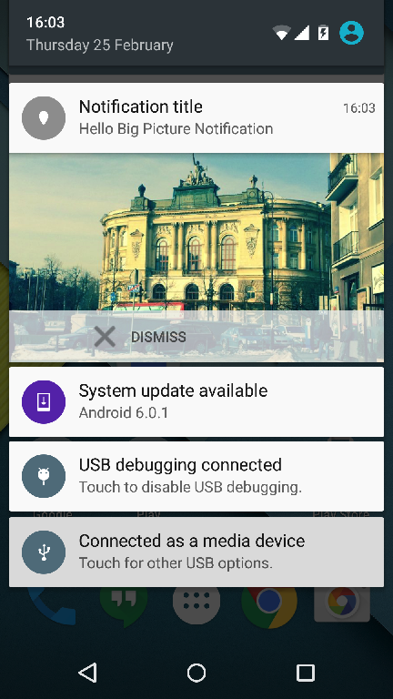

Ubudu-SDK Changelog:
-------------

<table>
<colgroup>
<col width="12%" />
<col width="14%" />
<col width="16%" />
<col width="56%" />
</colgroup>
<thead>
<tr class="header">
<th align="left">Version</th>
<th align="left">Date</th>
<th align="left">Author</th>
<th align="left">Modifications</th>
</tr>
</thead>
<tbody>
<tr class="odd">
<td align="left">1.0</td>
<td align="left">2013-10-01</td>
<td align="left">PJB</td>
<td align="left">Created.</td>
</tr>
<tr class="even">
<td align="left">1.0.1</td>
<td align="left">2013-10-02</td>
<td align="left">PJB</td>
<td align="left">Integred FK's comments.</td>
</tr>
<tr class="odd">
<td align="left">1.0.2</td>
<td align="left">2013-10-04</td>
<td align="left">PJB</td>
<td align="left">Integred answers to questions.</td>
</tr>
<tr class="even">
<td align="left">1.0.3</td>
<td align="left">2013-10-07</td>
<td align="left">PJB</td>
<td align="left">Added iBeacon Advertisement Messages section.</td>
</tr>
<tr class="odd">
<td align="left">1.0.4</td>
<td align="left">2013-10-09</td>
<td align="left">PJB</td>
<td align="left">Use java.util.Date instead of java.util.Calendar.</td>
</tr>
<tr class="even">
<td align="left">1.0.5</td>
<td align="left">2013-10-09</td>
<td align="left">PJB</td>
<td align="left">Added context parameter to start and stop on android.</td>
</tr>
<tr class="odd">
<td align="left">1.0.6</td>
<td align="left">2013-10-23</td>
<td align="left">PJB</td>
<td align="left">Split out UbuduIOSSDK, and changes to the server section.</td>
</tr>
<tr class="even">
<td align="left">1.0.7</td>
<td align="left">2013-11-04</td>
<td align="left">PJB</td>
<td align="left">Updated and precised the rule/action specification.</td>
</tr>
<tr class="odd">
<td align="left">1.0.8</td>
<td align="left">2013-11-08</td>
<td align="left">PJB</td>
<td align="left">Added UbuduSDK displayWebPage and openPassbook/SamsungWallet utility methods. Refined description of user notifications processing.</td>
</tr>
<tr class="even">
<td align="left">1.0.9</td>
<td align="left">2013-11-21</td>
<td align="left">PJB</td>
<td align="left">Changed the schedule data structure to match the Ruby library used on the server.</td>
</tr>
<tr class="odd">
<td align="left">1.0.10</td>
<td align="left">2013-11-25</td>
<td align="left">PJB</td>
<td align="left"><ul>
<li>renamed version field to api_version in the request.</li>
<li>changed the structure of timezone field.</li>
<li>Added algorithm for opening time schedule.</li>
</ul></td>
</tr>
<tr class="even">
<td align="left">1.0.11</td>
<td align="left">2013-12-30</td>
<td align="left">PJB</td>
<td align="left"><ul>
<li>added the udid field to api requests.</li>
</ul></td>
</tr>
<tr class="odd">
<td align="left">1.0.12</td>
<td align="left">2014-04-24</td>
<td align="left">PJB</td>
<td align="left"><ul>
<li>added specification of JSON payload in notification message.</li>
</ul></td>
</tr>
<tr class="even">
<td align="left">1.0.13</td>
<td align="left">2014-08-13</td>
<td align="left">PJB</td>
<td align="left"><ul>
<li>added the UbuduUser interface.</li>
</ul></td>
</tr>
<tr class="odd">
<td align="left">1.1.0</td>
<td align="left">2014-08-25</td>
<td align="left">PJB</td>
<td align="left">Added UbuduUser interface.</td>
</tr>
<tr class="even">
<td align="left">1.1.1</td>
<td align="left">2014-08-26</td>
<td align="left">PJB</td>
<td align="left">Added anti hacking protocol configuration from the server.</td>
</tr>
<tr class="odd">
<td align="left">1.1.2</td>
<td align="left">2014-08-28</td>
<td align="left">PJB</td>
<td align="left">Added statusChange() delegate method.</td>
</tr>
<tr class="even">
<td align="left">1.2.0</td>
<td align="left">2014-09-16</td>
<td align="left">TZ</td>
<td align="left">Added setFileLogEnabled flag for enabling getting / clearing logs.</td>
</tr>
<tr class="odd">
<td align="left">1.2.1</td>
<td align="left">2014-09-18</td>
<td align="left">TZ</td>
<td align="left">Added support for custom baseURL.</td>
</tr>
<tr class="even">
<td align="left">1.2.3</td>
<td align="left">2014-10-06</td>
<td align="left">TZ</td>
<td align="left">Fix for WiFi &amp; BLE issues.</td>
</tr>
<tr class="odd">
<td align="left">1.2.5</td>
<td align="left">2014-10-17</td>
<td align="left">TZ</td>
<td align="left">Support for continous proximities.</td>
</tr>
<tr class="even">
<td align="left">1.3.0</td>
<td align="left">2014-11-06</td>
<td align="left">TZ</td>
<td align="left">Added setWifiBleFixDisabled for disabling fix for wifi &amp; ble ble issue. Fix bug with user's tags.</td>
</tr>
<tr class="odd">
<td align="left">1.4.0</td>
<td align="left">2014-11-13</td>
<td align="left">Tomasz Ziolkowski</td>
<td align="left">
Add setRegionExitMinDelay setter to set delay after which delegate get notified about exiting region.
 Regions are defined by proximiy UUID. That means all beacons with the same proximityUUID and different major/minor belongs to same region.
</td>
</tr>
<tr class="even">
<td align="left">1.4.1</td>
<td align="left">2014-11-19</td>
<td align="left">TZ</td>
<td align="left">Bug fixes</td>
</tr>
<tr class="odd">
<td align="left">1.4.2</td>
<td align="left">2014-12-09</td>
<td align="left">TZ</td>
<td align="left">Proximity accuracy improved</td>
</tr>
<tr class="even">
<td align="left">1.4.3</td>
<td align="left">2014-12-23</td>
<td align="left">TZ</td>
<td align="left">Add min/max events count/periods for rules and for the app. Add some more log events.</td>
</tr>
<tr class="odd">
<td align="left">1.4.5</td>
<td align="left">2015-01-13</td>
<td align="left">JBQ</td>
<td align="left"><dl>
<dt>Bug due to Dexguard config which was making</dt>
<dd>
the SDK unusable.

</dd>
</dl></td>
</tr>
<tr class="even">
<td align="left">1.4.6</td>
<td align="left">2015-02-09</td>
<td align="left">TZ</td>
<td align="left">Fix a bug causes reset limit counters. Fix region behaviour.</td>
</tr>
<tr class="odd">
<td align="left">1.4.7</td>
<td align="left">2015-02-12</td>
<td align="left">TZ</td>
<td align="left">Fix group and regions behaviour. Update for log events.</td>
</tr>
<tr class="even">
<td align="left">1.4.8</td>
<td align="left">2015-03-17</td>
<td align="left">TZ</td>
<td align="left"><ul>
<li>Improve stability of the SDK.</li>
<li>Add mediumFar and highFar proximities</li>
</ul></td>
</tr>
<tr class="odd">
<td align="left">1.4.9</td>
<td align="left">2015-04-02</td>
<td align="left">TZ</td>
<td align="left"><ul>
<li>Improve rsi measurements.</li>
<li>Fix bug with starting sdk.</li>
</ul></td>
</tr>
<tr class="even">
<td align="left">1.4.10</td>
<td align="left">2015-04-09</td>
<td align="left">TZ</td>
<td align="left">Fix getting native device from UbuduBeacon.</td>
</tr>
<tr class="odd">
<td align="left">1.5.0</td>
<td align="left">2015-04-17</td>
<td align="left">TZ</td>
<td align="left">Stability improvements and bug fixes Reduced verbosity of logcat/logs. Lower frequency to send async logged event to server. Deep linking actions. Optimisation of user tags management tags management.</td>
</tr>
<tr class="odd">
<td align="left">1.6.0</td>
<td align="left">2015-05-12</td>
<td align="left">TZ</td>
<td align="left">
Fix bug while working with secured beacons.
 
Add API for between log setting period events.

Improve rssi averaging.
 
Fix for relative proximity.
 
Add API for reseting global event counter.
 
Reduced battery consumption.
</td>
</tr>
<tr class="odd">
<td align="left">1.7.0</td>
<td align="left">2015-05-19</td>
<td align="left">TZ</td>
<td align="left">
Multiline notifications.

Mesh (beta).

Indoor Location (beta).
 
Bug fixes.
</td>
</tr>
<tr class="odd">
<td align="left">1.7.1</td>
<td align="left">2015-05-29</td>
<td align="left">TZ</td>
<td align="left">
No toasts from ubudu sdk.

Custom alertTitle for notification.

Minor fixes.
</td>
</tr>
<tr class="odd">
<td align="left">1.7.2</td>
<td align="left">2015-05-29</td>
<td align="left">TZ</td>
<td align="left">
Bug fixes.
</td>
</tr>
<tr class="odd">
<td align="left">1.7.3</td>
<td align="left">2015-06-09</td>
<td align="left">TZ</td>
<td align="left">
Fix for uuid bug.

Restart Ubudu service after app killing.

Fix UI freeze while starting the beacon manager.

Other bug fixes.
</td>
</tr>
<tr class="odd">
<td align="left">1.8.0</td>
<td align="left">2015-06-30</td>
<td align="left">MG</td>
<td align="left">
Performance improvements for namespaces with high number of interaction rules.

Other bug fixes.
</td>
</tr>
<tr class="odd">
<td align="left">1.8.1</td>
<td align="left">2015-07-01</td>
<td align="left">MG</td>
<td align="left">
Fixed matching regions to beacon.
</td>
</tr>
<tr class="odd">
<td align="left">1.8.2</td>
<td align="left">2015-07-08</td>
<td align="left">MG</td>
<td align="left">
Fix scanning periods custom settings

Added methods to customize rules fetching period

Fixed custom notification mechanism after app is killed
</td>
</tr>
<tr class="odd">
<td align="left">1.8.3</td>
<td align="left">2015-07-14</td>
<td align="left">MG</td>
<td align="left">
Custom notification fix when the app is killed

Minor API update for indoor location and mesh
</td>
</tr>
<tr class="odd">
<td align="left">1.8.4</td>
<td align="left">2015-07-23</td>
<td align="left">MG</td>
<td align="left">
Fix for rare issue with fetching rules

Fix stopping a beacon manager

Minor Indoor Location improvements

Minor API updates
</td>
</tr>
<tr class="odd">
<td align="left">1.8.5</td>
<td align="left">2015-08-05</td>
<td align="left">MG</td>
<td align="left">
Fix of Indoor Location not always starting

Stability improvements
</td>
</tr>
<tr class="odd">
<td align="left">1.9.0</td>
<td align="left">2015-09-07</td>
<td align="left">MG</td>
<td align="left">

New beacon service updated for Lollipop

Updated indoor location delegate

Geofences updated for Google Play Services v7.8

Improved and updated ubudu mesh

Enhance manager logs handling

Improved rules triggering after latch time

Fixed bug of rules not always being fetched when Ubudu SDK was initially started in offline mode

Bug fixes and stability improvements

</td>
</tr>
<tr class="odd">
<td align="left">1.9.1</td>
<td align="left">2015-09-09</td>
<td align="left">MG</td>
<td align="left">

Indoor Location Georeference functionality

Indoor Location delegate methods fixes

Bug fixes and stability improvements

</td>
</tr>
<tr class="odd">
<td align="left">1.9.2</td>
<td align="left">2015-09-10</td>
<td align="left">TZ</td>
<td align="left">

Mesh fix while for sending message without ACK

</td>
</tr>
<tr class="odd">
<td align="left">1.9.3</td>
<td align="left">2015-09-29</td>
<td align="left">MG</td>
<td align="left">

Indoor Location:

* polygon zones handling

* public path finding method

* enhanced location accuracy and stability

* geographical coordinates are now returned in degrees

* map overlay image url is available from within json

</td>
</tr>
<tr class="odd">
<td align="left">1.9.4</td>
<td align="left">2015-09-29</td>
<td align="left">MG</td>
<td align="left">

Indoor Location:

* polygon distance calculation fix

</td>
</tr>
<tr class="odd">
<td align="left">1.9.5</td>
<td align="left">2015-10-19</td>
<td align="left">MG</td>
<td align="left">

Added motion filtering for indoor location stability

Added ranged beacon notifier API method for both proximity and indoor location that allows to see beacons currently being ranged by the SDK

Added API method allowing to get a JSONObject of indoor location map for saving purpose

Added API methods for customizing ranging/monitoring scan periods within indoor location manager

Bug fixes and stability improvements

</td>
</tr>
<tr class="odd">
<td align="left">1.9.6</td>
<td align="left">2015-10-19</td>
<td align="left">MG</td>
<td align="left">

Android manifest fix

</td>
</tr>
<tr class="odd">
<td align="left">1.9.7</td>
<td align="left">2015-11-06</td>
<td align="left">MG</td>
<td align="left">

Contextual Interactions SDK:

* added support for new maximum distance medium-far feature available in the manager platform

* active regions are now cleared after SDK has been stopped

* added public method `com.ubudu.sdk.UbuduSDK.resetAllEventsCounters()` that allows to reset all events counters

Indoor Location SDK:

* indoor location map data processing before start is now much faster

* delegate methods are called also after the very first position calculation

Other:

* fixed release .pom file notes

* bugs and stability improvements

</td>
</tr>
<tr class="odd">
<td align="left">1.9.8</td>
<td align="left">2015-11-09</td>
<td align="left">MG</td>
<td align="left">

Fixed an issue of Contextual Interactions SDK start being delayed in case when Indoor Location SDK has been started short moment before

</td>
</tr>
<tr class="odd">
<td align="left">1.9.9</td>
<td align="left">2015-11-10</td>
<td align="left">MG</td>
<td align="left">

Indoor Location:

* Fixed a bug of map fetching retry mechanism

</td>
</tr>
<tr class="odd">
<td align="left">1.9.10</td>
<td align="left">2015-11-12</td>
<td align="left">MG</td>
<td align="left">

Fixed an issue of server notification title not being overriden.

</td>
</tr>
<tr class="odd">
<td align="left">1.10.0</td>
<td align="left">2015-12-01</td>
<td align="left">MG</td>
<td align="left">

Issues fixed:

* doubled contextual rules fetching

* server notification title not being set

* receiving double mesh messages

Improvements:

* removed `com.google.android.gms.permission.ACTIVITY_RECOGNITION` from the manifest. If developer wants to take advantage of the additional motion sensor filtering within the Indoor Location SDK (improves position stability) this permission must be manually added to the app's manifest.

Features added:

* new API method for decrementing and reseting rule counter when the developer does not want to perform action to the user during custom event handling

* logic alignments with the new features related to contextual rules introduced in the manager platform

* Changed `UbuduAreaDelegate` method `notifyUserForEvent(UbuduEvent event)` from void type to boolean.

* Added new `UbuduAreaDelegate` method `void notifyUserForEvent(UbuduEvent event, UbuduAreaDelegateEventHandlingResponseListener responseListener)` for custom event handling in which the decision about performing action to the user is to be delayed.

</td>
</tr>
<tr class="odd">
<td align="left">2.0.0</td>
<td align="left">2016-01-06</td>
<td align="left">MG</td>
<td align="left">

Improvements:

* greatly improved SDK init time

* bug fixes and stability improvements

Features added:

* removed Indoor Location API and Mesh API. These packages are now available at separate repositories

</td>
</tr>
<tr class="odd">
<td align="left">2.0.1</td>
<td align="left">2016-01-15</td>
<td align="left">MG</td>
<td align="left">

Features added:

* changed public API pattern so the methods parameters names are understandable,

* added API for adding custom http request headers for server notification

Issues addressed:

* UbuduService is now properly destroyed and removed from the application processes when stop is called from beacon/geofence managers

</td>
</tr>
<tr class="odd">
<td align="left">2.0.2</td>
<td align="left">2016-02-10</td>
<td align="left">MG</td>
<td align="left">

Issues addressed:

* fixed db issues when migrating from version 1.9.+ to version >=2.0.0

* fixed ANR when calling resetAllEventsCounters() method

* fixed rare crash when using a dump json log file feature

* fixed rare issue when beacon monitoring was not started when another scanning Ubudu library was working in paralel

* fixed issue when log "uBeacon monitoring started." was shown after asking manager to stop

</td>
</tr>
<tr class="odd">
<td align="left">2.0.3</td>
<td align="left">2016-02-12</td>
<td align="left">MG</td>
<td align="left">

Improvements:

* stripped down google-play-services dependency

Issues addressed:

* fixed some migration issues

</td>
</tr>
<tr class="odd">
<td align="left">2.0.6</td>
<td align="left">2016-02-17</td>
<td align="left">MG</td>
<td align="left">

Improvements:

* Got rid of unnecessary permissions

Issues addressed:

* minor bug fixes related to switching between applications (namespaces)

* minor fixes related to BLE scanning

</td>
</tr>
<tr class="odd">
<td align="left">2.0.7</td>
<td align="left">2016-02-25</td>
<td align="left">MG</td>
<td align="left">

Features added:

* added big icon style automatic notifications handling ( http://developer.android.com/reference/android/app/Notification.BigPictureStyle.html ). Big icon url must be defined in the rule in the Ubudu Manager Platform. Example: 

Issues addressed:

* fix few NPE crashes

* fix lack of permissions related crashes on Android M

</td>
</tr>
<tr class="odd">
<td align="left">2.0.10</td>
<td align="left">2016-03-05</td>
<td align="left">MG</td>
<td align="left">

Features added:

* added timestamp to UbuduBeacon object

Improvements:

* stabilized ranged beacon notifier output. Beacons do not dissapear immediately if they are not detected in a single scan

Issues addressed:

* fixed issue with switching between namespaces when sometimes the SDK stopped responding and could not be restarted

</td>
</tr>
<tr class="odd">
<td align="left">2.1.2</td>
<td align="left">2016-03-17</td>
<td align="left">MG</td>
<td align="left">

Features added:

* model specific distance estimation that improves the accuracy of device-beacon distance estimation

Improvements:

* improved custom event handling by adding additional UbuduCustomEventHandlingAreaDelegate interface that is an extension of the default UbuduAreaDelegate

Issues addressed:

* fixed triggering rules at medium-far and high-far proximities with custom distance treshold

</td>
</tr>
<tr class="odd">
<td align="left">2.2.0</td>
<td align="left">2016-03-22</td>
<td align="left">MG</td>
<td align="left">

API changes (details can be found in the updated <a href="ubudu-sdk-user-manual.md">manual</a>) :

* Changed the API for custom handling the events.

* removed UbuduGeofenceDelegate interface. UbuduAreaDelegate is the interface to be used both for geofences and beacons.

* removed context argument from area managers start/stop methods

Improvements:

* updated documentation and JavaDoc

Issues addressed:

* fixed geofences not triggering events

* open_notif type logs missing in the application statistics when custom handling the events

</td>
</tr>
<tr class="odd">
<td align="left">2.2.1</td>
<td align="left">2016-03-22</td>
<td align="left">MG</td>
<td align="left">

Improvements:

* UbuduEvent and few other API interfaces are now parcelable to improve the event custom handling in an Android app (from one activity to another etc)

</td>
</tr>
<tr class="odd">
<td align="left">2.2.2</td>
<td align="left">2016-04-13</td>
<td align="left">MG</td>
<td align="left">

Issues addressed:

* Fixed beacon distance calculation when distance was sometimes < 0m

</td>
</tr>
<tr class="odd">
<td align="left">2.2.3</td>
<td align="left">2016-04-17</td>
<td align="left">MG</td>
<td align="left">

Features added:

* added new methods to beacon/geofence manager which allow to execute actions of a particular event (like opening a web url in the default WebView) or just notify the SDK about event being custom handled on the app's side so proper statistic logs are posted to the back office. Please check the manual for details.

Issues addressed:

* Fixed SDK crashing on init because of an java.lang.NoClassDefFoundError

</td>
</tr>
<tr class="odd">
<td align="left">2.2.4</td>
<td align="left">2016-04-22</td>
<td align="left">MG</td>
<td align="left">

Issues addressed:

* Fixed a very serious bug that caused a significant growth of the app's total usage of internal memory over time

</td>
</tr>
<tr class="odd">
<td align="left">2.2.5</td>
<td align="left">2016-04-29</td>
<td align="left">MG</td>
<td align="left">

Features added:

* added Advertising ID support

* added support for new analytics logs related to device bluetooth state and location/notifications permissions

Improvements:

* removed Context argument from SDK's release method

* changed the deprecated `android.text.format.Time` class to java.util.Date object in the UbuduSDK `nextFetchTime()` and `setNextFetchTime` methods

* minor fixes and improvements

Issues addressed:

* fixed an issue with Ormlite's OpenHelperManager that could not be used in the app using Ubudu SDK

* fixed crashes occuring when app using Ubudu SDK is installed on pre API 18 devices

</td>
</tr>
<tr class="odd">
<td align="left">2.2.6</td>
<td align="left">2016-05-24</td>
<td align="left">MG</td>
<td align="left">

Issues addressed:

* fixed issues causing problems when building the final app with proguard

</td>
</tr>

<tr class="odd">
<td align="left">2.2.7</td>
<td align="left">2016-08-09</td>
<td align="left">MG</td>
<td align="left">

Issues addressed:

* fixed ANRs happening on Android M when scanning is triggered while app does not have geolocation permissions

</td>
</tr>

<tr class="odd">
<td align="left">2.2.8</td>
<td align="left">2016-09-12</td>
<td align="left">MG</td>
<td align="left">

Improvements:

* added callback to com.ubudu.sdk.UbuduSDK#setUserInformation method so the app can be notified about the result

* full UbuduArea object is passed into areaEntered delegate method

* WebSettings.MIXED_CONTENT_COMPATIBILITY_MODE is now added to the SDK's default WebView so the pages with mixed content are properly displayed

Issues addressed:

* fixed crash occuring when com.ubudu.sdk.UbuduBeaconRegion toString() method was called

* fixed user tags not being properly passed to web api

* fixed rare crash happening on some Samsung devices related to lack of android.permission.BLUETOOTH permission

* delegate's methods areaEnterd and areaExited are now called on a main thread (now there is no need to create separate Handler on the app's side)

</td>
</tr>

<tr class="odd">
<td align="left">2.3.0</td>
<td align="left">2016-11-15</td>
<td align="left">MG</td>
<td align="left">

Improvements:

* updated REST API library 

* replace palceholders also in alertTitle and custom payload

* updated Google Play Location Services to version 9.8.0

API changes:

* UbuduRegisteringUserCallback renamed to UbuduCompletionCallback

</td>
</tr>

<tr class="odd">
<td align="left">2.4.0</td>
<td align="left">2016-11-24</td>
<td align="left">MG</td>
<td align="left">

Features added:

<ul><li>rich notifications handling</li>
<li>notifications pop out effect to rich notifications and background notifications</li></ul>

Issues addressed:

<ul><li>fixed issue of logs not always being posted to server properly</li>
<li>fixed geofence rules not being triggered due to position updates being delayed to much</li>
<li>fixed pending status bar notifications not being cancelled when app is killed</li>
</ul>

API changes:

<ul><li>new delegate method: `void notificationActionTriggeredForEvent(UbuduEvent event, String actionIdentifier)` for handling rich notification action buttons click events</li>
<li>renamed beacon/geofence manager methods: 
- `executeActionsForEvent ` to `executeDefaultActionsForEvent` 
- `actionsCustomExecutedForEvent` to `defaultActionsExecutedForEvent`</li>
</ul>
</td>
</tr>

<tr class="odd">
<td align="left">2.4.1</td>
<td align="left">2016-11-25</td>
<td align="left">MG</td>
<td align="left">

Issues addressed:

<ul><li>fixed permissions and bluetooth state analytic logs syntax</li>
</ul>
</td>
</tr>

<tr class="odd">
<td align="left">2.4.2</td>
<td align="left">2016-12-15</td>
<td align="left">MG</td>
<td align="left">

Features added:

<ul><li>Way to handle rich notification actions after app has been killed. New intent called `com.ubudu.sdk.service.UbuduService.action.ACTION_SERVICE_RESTARTED_WITH_EVENT` is now broadcasted when rich notification custom action is clicked while the app is killed. Mobile app should register a broadcast receiver for this intent to process the custom action with developer's own logic. See <a href="https://github.com/Ubudu/Android-SDK/wiki/Rich-notifications">wiki article</a> for more details.</li></ul>

Improvements:

<ul><li>Advertising ID is now not posted for analytics until the app asks for it by calling `enableAdvertisingIdCollection(true)` method on `com.ubudu.UbuduSDK`instance</li></ul>

Issues addressed:

<ul>
<li>rich notificatios actions not being passed to the delegate properly</li>
<li>rare crash occuring when SDK release() method is called</li>
<li>multiple `returning user` log posted at the SDK start</li>
</ul>
</td>
</tr>

<tr class="odd">
<td align="left">2.5.0</td>
<td align="left">2017-01-19</td>
<td align="left">MG</td>
<td align="left">

Features added:

<ul><li>None</li></ul>

Improvements:

<ul><li>Analytics logs sending improved</li></ul>
<ul><li>When notification has no title and body the application name is used as a title of the background notification</li></ul>

Issues addressed:

<ul>
<li>Group rules limits not working properly</li>
<li>Crash related to BroadcastReceiver registration</li>
<li>Replacing placeholders in the rule custom payload</li>
<li>Issues related to controlling geofence and beacon managers auto restart</li>
</ul>
</td>
</tr>

<tr class="odd">
<td align="left">2.5.1</td>
<td align="left">2017-01-23</td>
<td align="left">MG</td>
<td align="left">

Issues addressed:

<ul>
<li>Rules limits not working properly</li>
<li>Crash related to BroadcastReceiver registration</li>
</ul>
</td>
</tr>

<tr class="odd">
<td align="left">2.5.3</td>
<td align="left">2017-01-26</td>
<td align="left">MG</td>
<td align="left">

Features added:</o>
<ul>
<li>beacon battery level API</li>
</ul>

Issues addressed:

<ul>
<li>service auto restart not working</li>
<li>placeholders not filled for geofence rules</li>
<li>crashes</li>
</ul>
</td>
</tr>

<tr class="odd">
<td align="left">2.5.4</td>
<td align="left">2017-02-01</td>
<td align="left">MG</td>
<td align="left">

Issues addressed:

<ul>
<li>global limits being respected even if a rule is not to be counted for global limits</li>
<li>event counters limits not being updated properly in the local database after new data is fetched from cloud</li>
</ul>
</td>
</tr>

</tbody>
</table>

Authors:

-   FK: François Kruta \<<francois.kruta@ubudu.com>\>
-   PJB: Pascal Bourguignon \<<pascal.bourguignon@ubudu.com>\>
-   TZ: Tomasz Ziolkowski \<<tomasz.ziolkowski@ubudu.com>\>
-   MG: Michal Gasztold \<<michal.gasztold@ubudu.biz>\>
