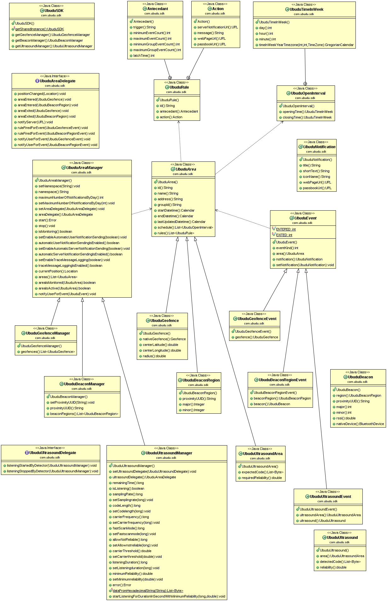

`Ubudu SDK` Specifications - version 1.8.0
==========================================

Introduction
------------

This is the specifications and documentation of the Ubudu SDK.

This SDK contains several components:

-   Ubudu Geofence SDK
-   Ubudu Proxmity Beacon SDK (Bluetooth)

Modifications
-------------

<table>
<colgroup>
<col width="12%" />
<col width="14%" />
<col width="16%" />
<col width="56%" />
</colgroup>
<thead>
<tr class="header">
<th align="left">Version</th>
<th align="left">Date</th>
<th align="left">Author</th>
<th align="left">Modifications</th>
</tr>
</thead>
<tbody>
<tr class="odd">
<td align="left">1.0</td>
<td align="left">2013-10-01</td>
<td align="left">PJB</td>
<td align="left">Created.</td>
</tr>
<tr class="even">
<td align="left">1.0.1</td>
<td align="left">2013-10-02</td>
<td align="left">PJB</td>
<td align="left">Integred FK's comments.</td>
</tr>
<tr class="odd">
<td align="left">1.0.2</td>
<td align="left">2013-10-04</td>
<td align="left">PJB</td>
<td align="left">Integred answers to questions.</td>
</tr>
<tr class="even">
<td align="left">1.0.3</td>
<td align="left">2013-10-07</td>
<td align="left">PJB</td>
<td align="left">Added iBeacon Advertisement Messages section.</td>
</tr>
<tr class="odd">
<td align="left">1.0.4</td>
<td align="left">2013-10-09</td>
<td align="left">PJB</td>
<td align="left">Use java.util.Date instead of java.util.Calendar.</td>
</tr>
<tr class="even">
<td align="left">1.0.5</td>
<td align="left">2013-10-09</td>
<td align="left">PJB</td>
<td align="left">Added context parameter to start and stop on android.</td>
</tr>
<tr class="odd">
<td align="left">1.0.6</td>
<td align="left">2013-10-23</td>
<td align="left">PJB</td>
<td align="left">Split out UbuduIOSSDK, and changes to the server section.</td>
</tr>
<tr class="even">
<td align="left">1.0.7</td>
<td align="left">2013-11-04</td>
<td align="left">PJB</td>
<td align="left">Updated and precised the rule/action specification.</td>
</tr>
<tr class="odd">
<td align="left">1.0.8</td>
<td align="left">2013-11-08</td>
<td align="left">PJB</td>
<td align="left">Added UbuduSDK displayWebPage and openPassbook/SamsungWallet utility methods. Refined description of user notifications processing.</td>
</tr>
<tr class="even">
<td align="left">1.0.9</td>
<td align="left">2013-11-21</td>
<td align="left">PJB</td>
<td align="left">Changed the schedule data structure to match the Ruby library used on the server.</td>
</tr>
<tr class="odd">
<td align="left">1.0.10</td>
<td align="left">2013-11-25</td>
<td align="left">PJB</td>
<td align="left"><ul>
<li>renamed version field to api_version in the request.</li>
<li>changed the structure of timezone field.</li>
<li>Added algorithm for opening time schedule.</li>
</ul></td>
</tr>
<tr class="even">
<td align="left">1.0.11</td>
<td align="left">2013-12-30</td>
<td align="left">PJB</td>
<td align="left"><ul>
<li>added the udid field to api requests.</li>
</ul></td>
</tr>
<tr class="odd">
<td align="left">1.0.12</td>
<td align="left">2014-04-24</td>
<td align="left">PJB</td>
<td align="left"><ul>
<li>added specification of JSON payload in notification message.</li>
</ul></td>
</tr>
<tr class="even">
<td align="left">1.0.13</td>
<td align="left">2014-08-13</td>
<td align="left">PJB</td>
<td align="left"><ul>
<li>added the UbuduUser interface.</li>
</ul></td>
</tr>
<tr class="odd">
<td align="left">1.1.0</td>
<td align="left">2014-08-25</td>
<td align="left">PJB</td>
<td align="left">Added UbuduUser interface.</td>
</tr>
<tr class="even">
<td align="left">1.1.1</td>
<td align="left">2014-08-26</td>
<td align="left">PJB</td>
<td align="left">Added anti hacking protocol configuration from the server.</td>
</tr>
<tr class="odd">
<td align="left">1.1.2</td>
<td align="left">2014-08-28</td>
<td align="left">PJB</td>
<td align="left">Added statusChange() delegate method.</td>
</tr>
<tr class="even">
<td align="left">1.2.0</td>
<td align="left">2014-09-16</td>
<td align="left">TZ</td>
<td align="left">Added setFileLogEnabled flag for enabling getting / clearing logs.</td>
</tr>
<tr class="odd">
<td align="left">1.2.1</td>
<td align="left">2014-09-18</td>
<td align="left">TZ</td>
<td align="left">Added support for custom baseURL.</td>
</tr>
<tr class="even">
<td align="left">1.2.3</td>
<td align="left">2014-10-06</td>
<td align="left">TZ</td>
<td align="left">Fix for WiFi &amp; BLE issues.</td>
</tr>
<tr class="odd">
<td align="left">1.2.5</td>
<td align="left">2014-10-17</td>
<td align="left">TZ</td>
<td align="left">Support for continous proximities.</td>
</tr>
<tr class="even">
<td align="left">1.3.0</td>
<td align="left">2014-11-06</td>
<td align="left">TZ</td>
<td align="left">Added setWifiBleFixDisabled for disabling fix for wifi &amp; ble ble issue. Fix bug with user's tags.</td>
</tr>
<tr class="odd">
<td align="left">1.4.0</td>
<td align="left">2014-11-13</td>
<td align="left">TZ</td>
<td align="left">Add setRegionExitMinDelay setter to set delay after which delegate get notified about exiting region Regions are defined by proximiy UUID. That means all beacons with the same proximityUUID and different major/minor belongs to the shame region.</td>
</tr>
<tr class="even">
<td align="left">1.4.1</td>
<td align="left">2014-11-19</td>
<td align="left">TZ</td>
<td align="left">Bug fixes</td>
</tr>
<tr class="odd">
<td align="left">1.4.2</td>
<td align="left">2014-12-09</td>
<td align="left">TZ</td>
<td align="left">Proximity accuracy improved</td>
</tr>
<tr class="even">
<td align="left">1.4.3</td>
<td align="left">2014-12-23</td>
<td align="left">TZ</td>
<td align="left">Add min/max events count/periods for rules and for the app. Add some more log events.</td>
</tr>
<tr class="odd">
<td align="left">1.4.5</td>
<td align="left">2015-01-13</td>
<td align="left">JBQ</td>
<td align="left"><dl>
<dt>Bug due to Dexguard config which was making</dt>
<dd>
the SDK unusable.

</dd>
</dl></td>
</tr>
<tr class="even">
<td align="left">1.4.6</td>
<td align="left">2015-02-09</td>
<td align="left">TZ</td>
<td align="left">Fix a bug causes reset limit counters. Fix region behaviour.</td>
</tr>
<tr class="odd">
<td align="left">1.4.7</td>
<td align="left">2015-02-12</td>
<td align="left">TZ</td>
<td align="left">Fix group and regions behaviour. Update for log events.</td>
</tr>
<tr class="even">
<td align="left">1.4.8</td>
<td align="left">2015-03-17</td>
<td align="left">TZ</td>
<td align="left"><ul>
<li>Improve stability of the SDK.</li>
<li>Add mediumFar and highFar proximities</li>
</ul></td>
</tr>
<tr class="odd">
<td align="left">1.4.9</td>
<td align="left">2015-04-02</td>
<td align="left">TZ</td>
<td align="left"><ul>
<li>Improve rsi measurements.</li>
<li>Fix bug with starting sdk.</li>
</ul></td>
</tr>
<tr class="even">
<td align="left">1.4.10</td>
<td align="left">2015-04-09</td>
<td align="left">TZ</td>
<td align="left">Fix getting native device from UbuduBeacon.</td>
</tr>
<tr class="odd">
<td align="left">1.5.0</td>
<td align="left">2015-04-17</td>
<td align="left">TZ</td>
<td align="left">Stability improvements and bug fixes Reduced verbosity of logcat/logs. Lower frequency to send async logged event to server. Deep linking actions. Optimisation of user tags management tags management.</td>
</tr>
<tr class="even">
<td align="left">
1.6.0

<blockquote>

|

|

</blockquote></td>
<td align="left">
2015-05-12

<blockquote>

|

|

</blockquote></td>
<td align="left">
TZ

<blockquote>

|- Add AP

</blockquote>

|- Reduced ba
</td>
<td align="left"><ul>
<li>Improve averaging rssi</li>
<li>Fix for relative proximity</li>
</ul>
- Add API for resetting global event counter I for setting period between logs - Fix bug while working with secured beacons ttery consumption</td>
</tr>
<tr class="odd">
<td align="left"><dl>
<dt>1.7.0</dt>
<dd>
|

|

|

</dd>
</dl></td>
<td align="left"><dl>
<dt>2015-05-19</dt>
<dd>
|

|

|

</dd>
</dl></td>
<td align="left">
TZ |

|

|
</td>
<td align="left">
Multiline notifications

Mesh (beta)

Indoor location (beta)

Bug fix
</td>
</tr>
<tr class="even">
<td align="left"><dl>
<dt>1.7.1</dt>
<dd>
|

|

</dd>
</dl></td>
<td align="left"><dl>
<dt>2015-05-29</dt>
<dd>
|

|

</dd>
</dl></td>
<td align="left"><dl>
<dt>TZ</dt>
<dd>
|

</dd>
</dl>
|</td>
<td align="left">
No toasts from ubudu sdk

Custom alertTitl for notification

Minor fixes
</td>
</tr>
<tr class="odd">
<td align="left">1.7.2</td>
<td align="left">2015-05-29</td>
<td align="left">TZ</td>
<td align="left">Bug fixes</td>
</tr>
<tr class="even">
<td align="left"><dl>
<dt>1.7.3</dt>
<dd><h3>|</h3>
<h4>|</h4>

|

</dd>
</dl></td>
<td align="left"><dl>
<dt>2015-06-09</dt>
<dd><h3>|</h3>
<h4>|</h4>
<blockquote>
<h4>|</h4>
</blockquote>
</dd>
</dl></td>
<td align="left">TZ | |Restart Ubud |killing the | |Fix UI freez |beacon m |</td>
<td align="left">
Fix for uuid bug

u service after app

e while starting anager

Other bug fixes
</td>
</tr>
</tbody>
</table>

Colophon
--------

The source of this document is written in reStructured Text format. It is in the git repository under `documentation/specifications/ubudu-sdk-specifications.txt`.

We use rst2pdf, rst2html and pandoc to convert the reStructured Text format to PDF, HTML and GitHub MarkDown formats.

-   \_http://docutils.sourceforge.net/rst.html
-   \_http://rst2pdf.googlecode.com/svn/trunk/doc/manual.txt

You can generate various formats from it: :

    rst2html ubudu-sdk-specifications.txt    ubudu-sdk-specifications.html
    rst2pdf  ubudu-sdk-specifications.txt -o ubudu-sdk-specifications.pdf
    ./resolve-includes < ubudu-sdk-specifications.txt | pandoc -f rst -t markdown_github -o ubudu-sdk-specifications.md

(cf. Makefile in the `documentation/specifications/` directory).

Authors:

-   FK: François Kruta \<<francois.kruta@ubudu.com>\>
-   PJB: Pascal Bourguignon \<<pascal.bourguignon@ubudu.com>\>
-   TZ: Tomasz Ziolkowski \<<tomasz.ziolkowski@ubudu.com>\>

Legal status:

Copyright ©2013,2014 ubudu SAS, All right reserved

Table of Contents
-----------------

Areas
-----

##### General Description

Ubudu Geofences and Ubudu Beacon Regions share a lot of attributes and behavior. They are generalized as Ubudu Areas. While internally the handling of geofences and beacons differ, most of the API is common for both.

The `Ubudu SDK` works in background. On Android, it works in a service, which means that it can work without the application running.

All error conditions (network errors, invalid data, etc) are considered normal (eg. it is expected that a mobile device has intermitent network connectivity), and are handled by the `Ubudu SDK`. Therefore errors are muted, logs from the `Ubudu SDK` are restricted to the minimum.

The features of the `Ubudu SDK` API are similar on Android and on iOS.

There's a root shared instance of the `Ubudu SDK` class, that gives access to the specialized managers:

-   `UbuduGeofenceManager`
-   `UbuduBeaconManager`

The classes `UbuduGeofenceManager` and `UbuduBeaconManager` are subclasses of the abstract class `UbuduAreaManager`, which provides the following features:

-   set the namespace to select the areas specific to the application.
-   set the maximum number of notifications the user can receive each day (from 00:00:00 to 23:59:59 in the user time zone).
-   start and stop the background activities. The background activities (listening to geofence and beacons OS events, sending notifications, etc, shall occur even if the application is inactive).
-   allow/disallow automatic server notifications sending (allowed by default).
-   allow/disallow automatic user notification sending (allowed by default).
-   allow/disallow trace message logging, for debugging purpose (disabled by default).
-   get the current position as known by the SDK.
-   get the list of areas (geofences, beacon regions codes).
-   determine if an area is "monitored" (when the current position is close enough of the area, and the current local time is within the start/end dates and scheduled open times).
-   determine if an area is "active" (when the current position and current time is "inside").
-   notify the user for an area transition (to be used when automatic sending is not allowed, upon reception of an event indicating this area is activated or deactivated).
-   open and diplay the web page or the passbook/wallet url from the notification received by the application.

The Ubudu SDK sends the application the following messages:

-   position changed (new position): the geofence OS toolkits seem to have more precise and up-to-date positions than what is obtained by the application, so the SDK forwards it, when it gets it.
-   area entered event (area): This is a raw event. An action may not be taken by the SDK according to the rules.
-   area exited event (area): This is a raw event. An action may not be taken by the SDK according to the rules.
-   server notification (url): when automatic server notification sending is not allowed, the SDK sends this message to the application to let it notify the server thru the given url. When automatic server notification sending is allowed, the SDK sends the notifications automatically without informing the application.
-   area notification (event): when automatic user notification sending is disallowed, the SDK sends this message to the application, to let it send the \_notifications or otherwise deal with it. The application may have the SDK perform the default action by forwarding the event to the manager that sent it.
-   enable/disable SDK logging. To help debugging, the application can activate logging of messages by the Ubudu SDK. Messages are logged before sending each delegate message, and when significant internal events occur. Notably, log messages are issued to indicate that an action is not taken because of the constraints: number of events, time out of open schedule, etc.

(The platform specific SDKs may provide additionnal hooks or features).

The notifications\_ contain:

-   a title (string)
-   a short text (string)
-   an icon name (string)
-   a web page url to open when the user activates the notification.
-   a PassBook or Samsung Wallet url to open when the user activates the notification.

It is not expected to have both the web page url and the PassBook/Wallet url in the same notification, so only one action has to be taken.

The areas are introspectable, and have the following fields:

-   id (opaque string, non empty). Note: id are unique only within the same subclass of areas; eg. the same id may be used for beacon regions and for geofences.
-   name (string, possibly empty).
-   address (string, possibly empty).
-   group id (opaque string, or empty): geofences can belong to a group, which is used in some rule constraints.
-   start date time.
-   end date time.
-   the time zone of the area.
-   open schedule, a structure corresponding to the OpeningHours Ruby class https://github.com/alberthild/opening\_hours/blob/master/lib/opening\_hours.rb (as specified originally by \_http://rubylearning.com/blog/2010/05/25/rpcfn-business-hours-10/ but with the addition of a break period in the day):

    -   week, a structure with a slot for each day of the week, "mon", "tue", "wed", "thu", "fri", "sat", and "sun", each being a structure with "open" and "close" times specified as an integer, number of seconds since 00:00:00. When open=0 and close=0, or when the week day entry is missing, then there's no open times on that day.
    -   breaks, a structure with an optional slot for each day of the week, (same field names as in "week"), each being a structure with close and open times, which specify the times when the area not available.
    -   specific\_days, a structure with slots whose keys are the date of the specific day, in "YYYY-MM-DD" format, and whose values are structures with open and close times.

    The area is open when:

    -   the current time is in a specific day open and close interval and not in the breaks open and close interval of the current weekday, or, if the current time is not in a specific day:
    -   the current time is in the open and close interval of the day of the week in the week structure.

    The times are expressed as seconds since midnight. Notice that the DST shift days may be 23 or 25 hours.

    If the structure is absent or empty, then the schedule is Monday 00:00:00 to Sunday 23:59:59 (open all the time).

So, for example, with a structure such as :

    {"week":{
        "sun":{"close":0,"open":0},
        "mon":{"close":54000,"open":32400},
        "tue":{"close":54000,"open":32400},
        "wed":{"close":0,"open":0},
        "thu":{"close":54000,"open":32400},
        "fri":{"close":61200,"open":36000},
        "sat":{"close":54000,"open":32400}},
      "breaks":{
        "fri":{"close":48600,"open":46800}},
      "specific_days":{
        "2010-12-25":{"close":0,"open":0},
        "2013-12-25":{"close":0,"open":0},
        "2013-10-27":{"close":54000,"open":32400},
        "2013-12-27":{"close":54000,"open":36000}}}

would be interpreted as the following schedule:

<table>
<colgroup>
<col width="26%" />
<col width="62%" />
</colgroup>
<thead>
<tr class="header">
<th align="left">Day</th>
<th align="left">Schedule</th>
</tr>
</thead>
<tbody>
<tr class="odd">
<td align="left">Sunday</td>
<td align="left">closed</td>
</tr>
<tr class="even">
<td align="left">Monday</td>
<td align="left">open from 08:46:00 to 14:46:00</td>
</tr>
<tr class="odd">
<td align="left">Tuesday</td>
<td align="left">open from 08:46:00 to 14:46:00</td>
</tr>
<tr class="even">
<td align="left">Wednesday</td>
<td align="left">closed</td>
</tr>
<tr class="odd">
<td align="left">Thursday</td>
<td align="left">open from 08:46:00 to 14:46:00</td>
</tr>
<tr class="even">
<td align="left">Friday</td>
<td align="left">open from 09:46:00 to 12:46:00, and from 13:16:00 to 16:46:00</td>
</tr>
<tr class="odd">
<td align="left">Saturday</td>
<td align="left">open from 08:46:00 to 14:46:00</td>
</tr>
<tr class="even">
<td align="left">2010-12-25</td>
<td align="left">closed</td>
</tr>
<tr class="odd">
<td align="left">2013-10-27</td>
<td align="left">open from 07:46:00 to 13:46:00 (DST change on that day)</td>
</tr>
<tr class="even">
<td align="left">2013-12-25</td>
<td align="left">closed</td>
</tr>
<tr class="odd">
<td align="left">Friday 2013-12-27</td>
<td align="left">open from 09:46:00 to 12:46:00, and from 13:16:00 to 14:46:00.</td>
</tr>
</tbody>
</table>

-   rule/actions, a list of structures containing:

    > -   rule id (opaque string)
    > -   trigger (string) "on\_entry" or "on\_exit" (other trigger values are ignored by the SDK, but may be processed by the application).
    > -   latch time (integer or empty): minimum number of seconds without events, before the event is taken into account. The event is not taken into account if another event for this geofence occurs before this period of time. (Note: this includes incrementing counters). A negative value, or empty field is equivalent to 0.
    >
    >     Notice: GPS fixes have a period on the order of the second, while WIFI fixes have a period on the order of 5 seconds. Therefore latch times smaller than that are not useful. It's advised to use latch times 3-10 seconds if GPS localization is expected, and 15-30 seconds if WIFI localization is expected.
    >
    > -   minimum event count (integer or empty): the actions are not executed before this number of this trigger event occurs. A negative value, or empty field is equivalent to 0.
    > -   maximum event count (integer or empty): the actions are not executed after this number of this trigger event occurs. A negative value, or empty field is equivalent to ∞.
    > -   minimum group event count (integer or empty): the actions are not executed before this number of this trigger event occurs, group-wide. A negative value, or empty field is equivalent to 0.
    > -   maximum group event count (integer or empty): the actions are not executed after this number of this trigger event occurs, group-wide. A negative value, or empty field is equivalent to ∞.
    > -   for beacon regions, a maximum proximity category, a string "immediate", "near" or "far", or empty. When not empty, only the beacons with the given proximity or closer are selected.
    > -   notify server url template (string, possibly empty)
    > -   notify user text (string, possibly empty)
    > -   open url (string, possibly empty)
    > -   open pbk (string, possibly empty)

> Note: all those event counts should be persistent: once the maximum count is reached (even over several days), actions cannot be taken again, for the same geofence id (unless the counts in the geofence rule are changed).

-   last update date (ISO-8601 datetime, extended format, normally in UTC): last time the geofence parameters were edited.

Geofences have additionnally those attributes:

-   center lattitude (floating point, in degree, from -90.0 degree to +90.0 degree).
-   center longitude (floating point, in degree, from -180.0 degree to +180.0 degree).
-   radius (floating point, in meter, from 0.0 m to 40075017.0 m).

Beacon Regions have additionnally those attributes:

-   proximityUUID (string), the proximity UUID of the expected beacons,
-   major (integer or empty), the major identification number of the region (bluetooth device class). If empty, then beacons with any major id are detected. empty major ⇒ empty minor.
-   minor (integer or empty), the minor identification number of the region (bluetooth device class). If empty, then beacons with any minor id are detected.

###### Dataflow

    +------------------------------------------------+
    |                application                     |
    +------------------------------------------------+                                  
                |  ^                    \                                               
                |  |                     \                                              
                |  |                      \                                             
                |  |                       \                                            
                |  |                        \                                           
                |  |                         \web page url                              
        Configu-|  |beaconRegions             \                                         
         ration |  |                           v                                        
                |  |geofences           +---------------+                               
                |  |                    |    browser    |                               
                |  |                    +---------------+                               
                |  |                           ^                                        
                |  |                          /                                         
                |  |notifications            /                                          
                |  |                        /                                           
                |  |                       /                                            
                |  |                      /web page url                                 
                |  |                     /                                              
                v  |                    /                                               
    +-----------------------------------------+           +--------------------------+           
    |                UbuduSDK                 |<--------->|  OS geofencing & beacon  |
    +-----------------------------------------+           +--------------------------+           
              ^                            \                                            
              |                             \                                           
              |                              \                                 
              |beaconRegions                  \                                         
              |                                \notification server url                 
              |geofences                        \                                       
              |                                  \                                      
              |                                   v                                     
    +----------------------+               +------------------------+          
    | manager.ubudu.com    |               |  notification server   |                   
    +----------------------+               +------------------------+          

The application configures the `Ubudu SDK` instance. The `Ubudu SDK` gets the geofences and beacon regions from the `manager.ubudu.com` server, and uses the OS geofencing and bluetooth beacon services in background. When a geofence is entered or exited, or a beacon is detected or cease being detected, the `Ubudu SDK` performs the configured actions subject to the time, event count and rule constraints:

-   it notifies a server,
-   it notifies the users, which then may open a web page, or a `Passbook` or `Samsung Wallet`, or
-   it forwards the notification to the application which decides what to do.
-   the application can get the list of monitored geofences and beacon regions, and can check the active geofences and beacons.

###### Rules

####### Global rule

-   When a day change (local time zone) is detected, the global number of notifications sent for the day is reset.

####### \_Server Action Hook

When a rule fires, as specified in the following section, the actions may include a server notify url template. When this is the case, this url locates a JSON record that indicates what to do next.

If the server is not reachable, the resource not available, or the server returns an error, or the returned resource is not a JSON structure with a version number understood by the SDK, then processing of this rule/action is aborted.

If the server returns a JSON structure it should be a structure containing:

`version`

> "2". Note: this is the version number of the response format.

`decision`

> A string, Either:
>
> -   `"disable"`, in which case further processing of the actions is disabled.
> -   `"enable"`, in which case further processing of the actions is enabled as specified below.
> -   `"notify"`, in which case further processing of the actions is enabled as specified below, using as `notify_user` and `open_url` or `open_pkb` the content of the following fields.

`notify_user`

> If empty, then no notification is sent to the user. Otherwise it should be a string containing a JSON structure. This JSON structure contains two fields:
>
> `alertBody`
>
> > A string containing a text to be presented to the user in a notification. If empty, then no notification is sent to the user.
>
> `payload`
>
> > A JSON dictionary containing any data specified by the application. This data is forwarded to the application thru the delegate.

`open_url`

> A string containing a URL template for a resource that will be presented to the user when he clicks on the notification. If `notify_user` is empty or `notify_user.alertBody` is empty or `open_url` is empty, then this url is ignored.

`open_pbk`

> A string containing a URL template to be used with PassBook or Samsung or Google Wallet. If empty, then no PassBook/Wallet interaction occurs. (if `notify_user` is empty or `notify_user.alertBody` is empty or `open_url` is not empty then `open_pbk` is ignored).

`version` and `decision` are mandatory fields.

`notify_user`, `open_url` and `open_pkb` are optional, and only used when `decision` is `"notify"`.

####### Area rule

The following rule applies for all area types (both geofences and beacon regions).

When an event occurs matching the trigger (on entry, on exit):

-   wait until the latch time is over without other events for the same area. If another event occurs, then the first one is ignored. The timeout restarts for the new event.
-   when the latch time is over, increment the event count for this trigger for this area.
-   when the area has a group id, increment the event count for this trigger for this group.

IF:

-   the global number of notifications sent for the day is less than the maximum number of notifications the user can receive each day, AND
-   current time is between the start date time and end date time of the area, AND
-   current time is within open hours of the area schedule, AND
-   there's no minimum event count OR the minimum event count is less or equal to the event count, AND
-   there's no maximum event count OR the maximum event count is greater or equal to the event count, AND
-   there's no group id, OR there's no minimum group event count OR the minimum group event count is less or equal to the group event count, AND
-   there's no group id, OR there's no maximum group event count OR the maximum group event count is greater or equal to the group event count, AND
-   for a beacon region, maximum\_proximity is empty, OR the detected proximity category is less or equal to the maximum\_proximity category,

THEN:

-   if there's a notify server url template `notify_server`, then:

    > -   if automatic server notification is allowed,
    >
    >     > -   then fetch the resource at the server notification url obtained from the server notify url template, and process the returned resource:
    >     >
    >     >     > • if the server can't be contacted, OR it returns an error,  
    >     >     > OR the resource returned is invalid, then abort processing of this rule.
    >     >     >
    >     >     > • if it a `"disable"` decision record, then abort processing  
    >     >     > of this rule.
    >     >     >
    >     >     > • if it a `"enable"` decision record, then continue normal  
    >     >     > processing.
    >     >     >
    >     >     > • if it a `"notify"` decision record, then use the  
    >     >     > `notify_user` and the `open_url` or `open_pbk` url template specified in the decision record.
    >     >     >
    >     > -   else send a notify server message to the delegate, and if the delegate returns true:
    >     >
    >     >     > • then continue processing of this rule.
    >     >     >
    >     >     > • else abort processing of this rule. (When the application  
    >     >     > aborts the processing of the rule, it may actually perform its own actions).
    >     >     >
-   if there is a non-empty notify user text `notify_user.alertBody`, then:

    > -   send the delegate a rule fired for event message.
    > -   increment the number of notifications for the day.
    > -   if the number of notifications for the day is less than or equal to the maximum number of notifications for the day, then:
    >
    >     > -   if automatic user notification is allowed:
    >     >
    >     >     > • then deliver the user notification, with the url built from  
    >     >     > the open\_url template or the open\_pbk template if present.
    >     >     >
    >     >     > • else send the delegate a notify user message with the  
    >     >     > notification data.
    >     >     >
####### User Notification Delivery

The user notification may be delivered immediately or be posted thru the OS user notification mechanism.

When the application is active and in the foreground, the SDK can open the web page (thru a modal window on iOS, or initiating a new activity on Android), or the PassBook/Samsung Wallet url, immediatly in the GUI thread.

When the application is inactive or in the background, the SDK sends an OS user notification in such a way (Intent on Android, UILocalNotification on iOS) that the application is activated when the user selects the notification. When the application processes the notification, it can call the `Ubudu SDK` displayWebPage method to perform the web page, or openPassbook: or openSamsungWallet method to perform the Passbook or wallet opening.

The rule described in the previous section ensures that no user notification is delivered if there's no notify\_user.alertBody text.

If there's no url in the notification, then only the text is displayed, and nothing is done when the user selects the notification.

If there's a web page url, then when the user selects the notification that activates the application so it can opened the web page

If there's no web page url, but there's a Passbook or Samsung Wallet url, then when the user selects the notification that activates the application so it can pass it to the Passbook or Samsung Wallet.

This ensures that the application is activated and can process or filter the notification. The `Ubudu SDK` provides methods to help the applicaiton handle the web page displaying or Passbook or Samsung Wallet opening.

####### Algorithm to determine if the current time is within open hours of the area schedule

The algorithm implemented in

\_https://github.com/alberthild/opening\_hours/blob/master/lib/opening\_hours.rb

must be followed. :

    def now_open?
      calculate_deadline(0, Time.zone.now.to_s) == Time.zone.now.to_formatted_s(:rfc822)
    end

    def calculate_deadline(job_duration, start_date_time)
      start_date_time = Time.zone.parse(start_date_time)
      today = Date.civil(start_date_time.year, start_date_time.month, start_date_time.day)
      open_hours = get_open_hours(today).offset(TimeUtils::seconds_from_midnight(start_date_time))
      break_hours_duration = get_break_duration(today)
      break_hours = get_break_hours(today)
      while job_duration >= open_hours.duration and open_hours.duration > 0
        job_duration -= open_hours.duration
        today = today.next
        open_hours = get_open_hours(today)
        break_hours = get_break_hours(today)
      end
      if (open_hours.open + job_duration).between?(break_hours.open, break_hours.close)
        job_duration += break_hours_duration
      end
      Time.zone.local(today.year, today.month, today.day, *TimeUtils::time_from_midnight(open_hours.open + job_duration)).to_formatted_s(:rfc822)
    end

    def get_open_hours(date)
      @specific_days[date] || @week[WEEK_DAYS[date.wday]]
    end

    def get_break_hours(date)
      @breaks.fetch(WEEK_DAYS[date.wday], OpenHours.new(0, 0))
    end

    def get_break_duration(date)
      bhours = get_break_hours(date)
      if bhours
        bhours.close - bhours.open
      end
    end

####### Update of the geofences

-   A simple rules engine (which will be later complexified) decide if an update of the position is triggered and if a request is made to the server to update the geofences
-   The logic here must be very accurate to minimize impact on battery.

**\* TBD**\*

###### Time

####### Timezones

-   legal or local timezone of the geofence (coordinates, at the current time).
-   user timezone as configured on the mobile device.

We specify the time zone of each area (geofence, beacon region area) in the data sent by the server.

####### Time

-   server time
-   local time, in the geofence
-   device time

It is expected that all times be approximatively the same. However, the timezone of the server, of a geofence and of the device may be different. Notably, different geofences may be in different timezones, or a given geofence may be at a different offset from UTC at different times (summer time/winter time shift).

####### Opening hours

The schedules are given in a hybrid data structure, as opening and closing seconds since midnight for specific days, or for each day of the week, minus one break period, opening and closing seconds since midnight, applying in both cases.

The local time zone of the area is used to determine the time of midnight of the current day, to which the schedule times are added.

It is assumed that the device clock is approximately synchronous with Earth clock, even if the device time zone is different, so that the schedule maps to the real opening hours.

###### Implementation API Design Rules

Implementation specific API will use native data types as much as possible to let the application easily and efficiently access the OS specific frameworks (possibly wrapped in thin objects to provide additionnal features). For example, considering `CLLocation` and `CLRegion` on iOS and `android.location.Location` and `com.google.android.gms.location.Geofence`. `CLRegion` and `com.google.android.gms.location.Geofence` will have to be wrapped in a SDK specific Geofence class with the additionnal attributes we provide.

Otherwise, as much as possible the same class structure and behavior of the SDK API should be provided on all plateforms, to ease porting/rewriting applications from one platform to the other (different languages non-withstanding).

Geofences
---------

##### Use cases

###### Setting the geofence - if user has enabled geofence capabilities

1.  Get current position for first update
2.  Get geofences around given position
3.  Server returns the list of geofences as json object
4.  Geofences are stored in the phone and are actived in the background

###### Geofences have been set and user has entered in a hot zone

1.  The Ubudu SDK performs a local notification based on the actions associated with the triggered and display message
2.  If the user clicks on the notification the app goes into foreground an action is performed. Actions that can be triggered:

    > -   Display a web-view in the app/ on top of current view
    > -   Display a specific view with Data
    > -   Notify the server that the user has entered into the zone
    > -   The local time when the user enters in the geofence is also used to decide if the notification what is triggered or not (i.e. no local notification message if the user enters the zone after business hours)

###### Flow scheme - updating geofences list

-   The Ubudu SDK periodically checks the list of geofences based on:

    > -   Last check time successful
    > -   Availability of network connection
    > -   New position (Use significant position monitoring)

-   A simple rules engine (which will be later complexified) decide if a update the position is triggered and if a request is made to the server to update the geofences
-   The logic here must be very accurate to minimize impact on battery of the check

##### Deployment diagram

The Ubudu SDK is embedded in customer applications. It communicates with the ubudu server, to get the geofences defined by the customer. It selects the relevant geofences (time, position), and configures them into the geofence SDK of the OS. When the geofence SDK of the OS detects a fence event, it sends it to the corresponding application where the Ubudu SDK processes it, and posts the required notifications, and forwards to the application the required events. The application may react accordingly, or leave the Ubudu SDK implement the default behavior.

    +-----------------------+
    | Application DARTY     |
    |  +----------+         |                                +---------------------+
    |  | UbuduSDK |---------|-------(request "DARTY")------->|                     |
    |  |          |<--------|-------(geofences "DARTY")------|                     |
    |  +----------+         |                                |                     |
    |    ^   |              |                                |                     |
    +-----------------------+                                |                     |
         |   |                                               |                     |
         |   v                                               |                     |
    +-----------------------------+                          |                     |
    | SDK geofence Apple/Android  |<--- GPS,Wifi,etc         | manager.ubudu.com   |
    +-----------------------------+                          |                     |
         |   ^                                               |                     |
         |   |                                               |                     |
    +-----------------------+                                |                     |
    |    v   |              |                                |                     |
    |  +----------+         |                                |                     |
    |  | UbuduSDK |---------|--(request "CARREFOUR")-------->|                     |
    |  |          |<--------|--(geofences "CARREFOUR")-------|                     |
    |  +----------+         |                                +---------------------+
    | Application CARREFOUR |
    +-----------------------+

##### Ubudu Geofence Web API

This section documents the Geofence Web API as used by the Android SDK and the iOS SDK, with the purpose of allowing interoperability of the Ubudu SDK with alternate servers.

Accessing direclty this API by applications is discouraged.

Note: the Web API for beacons and geofences are very similar: the only differences are:

-   the API URL,
-   the fields lat, lng, radius specific to geofences vs. the field proximity\_uid, major, minor specific to beacons, and
-   the field maximum\_proximity specific to beacon rules.

All the other fields and semantics are identical.

API URL: `/u_geofences.json`

Note: the API URL (host and path) should be easily changeable in the implementation. In the future, a method may be provided to let the application set this url.

Method: `GET`

Parameters:

`api_version`

> 2

`namespace`

> A key identifying the namespace for the application.

`udid`

> The UDID of the device requesting the bluetooth regions.

`lat`

> A floating point value giving the latitude [in degree] (from -90.000000 to 90.000000).

`lgn`

> A floating point value giving the longitude [in degree] (from -180.000000 to 180.000000).

`radius`

> A floating point value giving the radius around the point defined by the `lat` and `lgn` parameters in which the selected geofences must fall, [in *kilometer*] (from 0.0 to 40075.017).

Response:

A structure is returned, containing the following fields:

`query_params`

> The paramters of the query repeated.

`api_version`

> "2". Note: this is the version number of the response format. It could be different than the version number in the `query_params`.

`valid_until`

> An ISO-8601 format date such as `YYYY-MM-DDTHH:MM:SS±HH:MM` giving the end of validity of the following data.

`u_geofences`

> A vector of geofence definitions.

Each geofence definition is a structure with the following fields:

`lat`

> A floating point value giving the latitude of the center of the geofence [in degree] (from -90.000000 to 90.000000)

`lng`

> A floating point value giving the longitude of the center of the geofence [in degree] (from -90.000000 to 90.000000)

`radius`

> A floating point value giving the radius around the point defined by the `lat` and `lgn` parameters in which the selected geofences must fall, [in kilometer] (from 0.0 to 40075.017).

`id`

> An opaque string, identifier of the area.

`group_id`

> An opaque string, possibly empty, identifying a group of areas.

`name`

> A string giving the name of the area.

`address`

> A string giving the postal address of the area.

`start`

> An ISO-8601 format date such as `YYYY-MM-DDTHH:MM:SS±HH:MM` giving the start of validity of the area.

`end`

> An ISO-8601 format date such as `YYYY-MM-DDTHH:MM:SS±HH:MM` giving the end of validity of the area.

`timezone`

> A structure with the following fields:
>
> `zone`
>
> > A string specifying the timezone. It should be a timezone name, such as "Europe/Paris" (also called Olson name), so that it follows legal summer/winter timezone shifts, or it can be given as an ISO-8601 timezone designator such as "Z", "+02:00", "-1000", "+03". cf. <http://en.wikipedia.org/wiki/ISO_8601%23Time_zone_designators>
>
> `title`
>
> > A string.
>
> `offset`
>
> > A number specificing the number of seconds relative to UTC. eg. Europe/Paris has an offset of 3600 outside of DST.
>
> > `utc_offset`
> >
> > > A number specifying the number of hours relative relative to UTC. eg. Europe/Paris has an utc\_offset of 1 outside of DST.
> >
> > `dst`
> >
> > > A boolean (true or false) specifying whether the `offset` and `utf_offset` for the given `zone` take daylight saving time into account.

`schedule`

> A structure with the following fields:
>
> `week`
>
> > A structure with the following fields:
> >
> > > `mon`
> > >
> > > > An open time structure.
> > >
> > > `tue`
> > >
> > > > An open time structure.
> > >
> > > `wed`
> > >
> > > > An open time structure.
> > >
> > > `thu`
> > >
> > > > An open time structure.
> > >
> > > `fri`
> > >
> > > > An open time structure.
> > >
> > > `sat`
> > >
> > > > An open time structure.
> > >
> > > `sun`
> > >
> > > > An open time structure.
> >
> > The open time structures have the following fields:
> >
> > > `open`
> > >
> > > > An integer specifying the number of seconds since midnight (from 0 to 90000).
> > >
> > > `close`
> > >
> > > > An integer specifying the number of seconds since midnight (from 0 to 90000).
>
> `breaks`
>
> > A structure with the same fields as week above.
>
> `specific_days`
>
> > A structure whose fields are the specific date in the "YYYY-MM-DD" format, and the values are open time structures (cf. above).

`updated_at`

> An ISO-8601 format date such as `YYYY-MM-DDTHH:MM:SS±HH:MM` giving the last time the area data was updated.

`rules_actions`

> A vector of rule-actions.

Rule-actions are structures with the following fields:

`id`

> An integer, identifying the rule.

`rule`

> A structure containing the following fields:
>
> `trigger`
>
> > A string indicating the kind of event that will trigger the actions. The values processed by the SDK are "on\_entry" and "on\_exit", but other kind of events could configured.
>
> `min_events`
>
> > An integer (or empty) giving the minimum number of occurences of the event before the actions are taken. A negative value, or empty field is equivalent to 0.
>
> `max_events`
>
> > An integer (or empty) giving the maximum number of occurences of the event after which the actions are not taken. A negative value, or empty field is equivalent to ∞.
>
> `min_group_events`
>
> > An integer (or empty) giving the minimum number of occurences of the event group-wide before the actions are taken. A negative value, or empty field is equivalent to 0.
>
> `max_group_events`
>
> > An integer (or empty) giving the maximum number of occurences of the event group-wide after which the actions are not taken. A negative value, or empty field is equivalent to ∞.
>
> `latch_time`
>
> > An integer (or empty) giving the minimum number of seconds without events, before action is taken upon an event). The actions are not executed if another event for this area occurs before this period of time. A negative value, or empty field is equivalent to 0.

`action`

> A structure containing the following fields:
>
> `notify_server`
>
> > A string containing a URL template. The semantics of the notify server url is specified in the section Server Action Hook\_.
>
> `notify_user`
>
> > If empty, then no notification is sent to the user. Otherwise it should be a string containing a JSON structure. This JSON structure contains two fields:
> >
> > `alertBody`
> >
> > > A string containing a text to be presented to the user in a notification. If empty, then no notification is sent to the user.
> >
> > `payload`
> >
> > > A JSON dictionary containing any data specified by the application. This data is forwarded to the application thru the delegate.
>
> `open_url`
>
> > A string containing a URL template for a resource that will be presented to the user when he clicks on the notification. If `notify_user` is empty or `notify_user.alertBody` is empty or `open_url` is empty, then this url is ignored.
>
> `open_pbk`
>
> > A string containing a URL template to be used with PassBook or Samsung or Google Wallet. If empty, then no PassBook/Wallet interaction occurs. (if `notify_user` is empty or `notify_user.alertBody` is empty or `open_url` is not empty then `open_pbk` is ignored).

An URL template is an URL string that may contain possible multiple occurences of the "`{id}`", "`{lat}`", "`{lng}`", "`{udid}`", "`{namespace}`" substrings that will be substituted before being requested thru HTTP.

> `{id}`
>
> > Will be substituted by the identifier `id` of the area that triggered the action.
>
> `{lat}`
>
> > Will be substituted by the latitude of the device when the action was triggered.
>
> `{lng}`
>
> > Will be substituted by the longitude of the device when the action was triggered.
>
> `{udid}`
>
> > Will be substituted by the Unique Device IDentifier.
>
> `{namespace}`
>
> > Will be substituted by the namespace of the application.

Examples:

> [http://rest.notification.server/space/{namespace}/fence/{id}/device/{udid}](http://rest.notification.server/space/{namespace}/fence/{id}/device/{udid}) <http://query.notification.server/notify?namespace>={namespace}&id={id}&udid={udid}

Note: the response may contain more geofences than those included inside the specified radius and center position. It's up to the SDK and/or application to further filter the geofences used at a given time (notice that the devices may move, and the data may be used in the future (up to the validity date of the data).

Example:

A request URL such as: :

    `http://manager.ubudu.com/u_geofences.json?api_version=2
     &namespace=fd5293be82bc91ba4bedfae15b3a97253f1de5c4
     &lat=52.2319565&lgn=21.0208855&radius=10.0`_

may return a JSON structure such as the following (note it's not up-to-date with respect to the notify\_user format): :

    {"u_geofences":[{"id":52,
                      "lat":48.86821546,
                      "lng":2.3231598,
                      "address":"14 rue royale paris",
                      "name":"DEMO PRESENTATION 2",
                      "radius":0.1,
                      "start":"2013-07-30T00:00:00Z",
                      "end":"2013-08-30T00:00:00Z",
                      "updated_at":"2013-11-22T07:11:28Z",
                      "rules_actions":[{"id":61,
                                         "rule":{"trigger":"on_exit",
                                           "min_events":"-1"},
                                         "action":{"open_pbk":"",
                                           "open_url":"",
                                           "notify_user":"À bientôt ! Revenez vite,
     profiter de nos prochaines promotions !",
                                           "notify_server":""}},
                                       {"id":60,
                                         "rule":{"trigger":"on_entry",
                                           "min_events":"-1"},
                                         "action":{"open_pbk":"",
                                           "open_url":"http://mobile.ubudu.com/webcoupon/
                                                       117-demo-73987512-html?1374077612
                                                       &p_offer_id=227&stc_id=1373970685",
                                           "notify_user":"Offres exclusives en magasin,
     à moins de 100 m,
     ne les ratez pas !",
                                           "notify_server":""}}],
                      "timezone":{"zone":"Europe/Paris",
                        "title":"Europe/Paris",
                        "offset":3600,
                        "utc_offset":1,
                        "dst":"false"},
                      "schedule":{"week":{"sun":{"close":0,"open":0},
                          "mon":{"close":68400,"open":32400},
                          "tue":{"close":68400,"open":32400},
                          "wed":{"close":68400,"open":32400},
                          "thu":{"close":68400,"open":32400},
                          "fri":{"close":68400,"open":32400},
                          "sat":{"close":68400,"open":32400}},
                        "specific_days":{},
                        "breaks":{}}},
                    {"id":35,
                      "lat":48.87621805,
                      "lng":2.32686415,
                      "address":"10 rue d'amsterdam; 75009 Paris; France",
                      "name":"demo-shop-2--10--rue-d-amsterdam",
                      "radius":0.02,
                      "start":"2013-07-10T00:00:00Z",
                      "end":"2014-08-09T00:00:00Z",
                      "updated_at":"2013-11-22T07:11:26Z",
                      "rules_actions":[{"id":33,
                                         "rule":{"trigger":"on_exit",
                                           "min_events":"1"},
                                         "action":{"open_pbk":"",
                                           "open_url":"",
                                           "notify_user":"Reposez vous bien!",
                                           "notify_server":""}},
                                       {"id":32,
                                         "rule":{"trigger":"on_entry",
                                           "min_events":"1"},
                                         "action":{"open_pbk":"",
                                           "open_url":"http://mobile.ubudu.com/webcoupon/
                                                       117-demo-73987512-html?1373990153
                                                       &p_offer_id=227&stc_id=1373970685",
                                           "notify_user":"Venez découvrir nos offres !",
                                           "notify_server":""}}],
                      "timezone":{"zone":"Europe/Paris",
                        "title":"Europe/Paris",
                        "offset":3600,
                        "utc_offset":1,
                        "dst":"false"},
                      "schedule":{"week":{"sun":{"close":0,"open":0},
                          "mon":{"close":68400,"open":32400},
                          "tue":{"close":68400,"open":32400},
                          "wed":{"close":68400,"open":32400},
                          "thu":{"close":68400,"open":32400},
                          "fri":{"close":68400,"open":32400},
                          "sat":{"close":68400,"open":32400}},
                        "specific_days":{},
                        "breaks":{}}}],
      "valid_until":"2013-11-25T13:27:04+01:00",
      "query_params":{"api_version":"2",
        "namespace":"fd5293be82bc91ba4bedfae15b3a97253f1de5c4",
        "lat":"52.2319565",
        "lgn":"21.0208855",
        "radius":"10.0",
        "format":"json"}}

Proximity Beacons
-----------------

##### CONTEXT

• Blueotooth 4.0 Low Energy offers un-preceded opportunities to  
develop low costs proximity beacons that don’t require pairing.

• BLE available on iOS since iPhone 4S and supported on some Android  
devices (announced to be integrated in core system in May 2013).

• iOS7 launching in October providing new functionalities (IBeacons)  
to interact with proximity Beacons.

• These technology progresses are an opportunity for Ubudu to expand  
its technology stack and further reinforce its SDK and offering to brands that want to strengthen their loyalty and CRMs applications.

##### Use cases

###### Example

Similar to what we have done integrating the new geofence SDK with audio-watermarked ultra-sounds.

See You Tube link here :

\_http://www.youtube.com/watch?v=6qxg6x41RMI

###### Use Case \#1 – Detection of Presence

• A small BLE proximity beacon is placed inside the shop (e.g. next  
to the counter) of a retail brand.

• The user has a smartphone which is compatible with BLE and with an  
application containing the Ubudu SDK.

• When the user enters the store, the application (in the foreground or  
background) detects the proximity beacon and a specific code.

• The application handles specific actions following the detection of the  
beacon (e.g. notify the server, show a special coupon, show a special coupon served by the server etc).

####### Use Case \#1 – Information Flow

1.  The beacon broadcasts a specific code (see code programming).
2.  The application specifies the proximityUUID, and possibly a major and minor device classes, and a maximum distance class. The SDK detects the beacon with the same proximityUUID, and if given, major and minor, at the maximum distance class or less.
3.  The application triggers:

    > • Local actions (e.g. notifications, opening of a view - optional)
    >
    > • A server request (notification of presence or actions suggested by servers)

4.  The application eventually display the special code or customer specific offering to the user who can benefit from it in the store. The application records that this event has been fired.
5.  The server responds with eventually a special loyalty offer or a code to benefit from the offer as advertised.

Response code – rules / actions parameters

###### Use Case \#2 – Multiple Beacons

• Situation: same that use case \#1 but there are multiple Ubudu  
beacons broadcasting codes.

• Expected behavior:

• Case \#1: They broadcast the same code – the application acts as if there  
was a single location beacon and indicates the distance to the closest.

• Case \#2: They broadcast a different code – the application  
determines what is the closest beacon using RSSI and distinguish three cases.

• Clearly closer to beacon 1: trigger beacon 1.

• Clearly closer to beacon 2: trigger beacon 2.

• Undetermined: do nothing.

• We need to make a parallel to what happen with hand-over in GSM  
networks vs. base stations.

• In all case the application must keep a vector of Ubudu beacons in  
range that must be accessible within the SDK.

###### Use Case \#3 – Use of Phone as Beacon

• Instead of using a BLE device, the shop sales uses his iPhone \>4S  
as a BLE beacon by launching a specific application (different from the one used by the client).

• This feature is also helpful for testing and demonstrating.

###### Administration, Test & Configuration Application.

• Basic UI.

• Allow to set the code of a BLE beacon (except phone) (IF FEASABLE).

• Allow to test all the library code / i.e. train define values for  
proximity / visualize beacons in presence and values advertized.

###### Characteristics of the BLE Device

Preliminary

• Use easy to source, cheap BLE chip FCC compliant.

• Cell - battery powered (must have \>1 year autonomy if always on).

• Light and small white box that can be put with a double side tape  
on a wall.

• Easy to produce at scale (to be discussed).

Android Support

• Once iPhone library finished.

• Bluetooth 4.0 LE should be covered in Android 4.3 (announced in May  
2013) and will be available in several high end devices (Samsung S3/S4, HTC One, Droid RAZR etc).

Open Questions

• Implementing a standard profile i.e. (GATT, Proximity, OBEX )?  
(See : \_http://en.wikipedia.org/wiki/Bluetooth\_low\_energy ).

• CAD design for PCB and production assembly?

##### iBeacon Advertisement Messages

The Apple `iBeacon` compatible advertisement message format differs from the basic behavior of BLE modules. Usually you define a service which is advertised and then upon connection each characteristic can be read from the device (eg. proximityUUID, major, minor). In case of iBeacon compatible advertising message there is no information about the services available on the device but only a specific message containing the proximityUUID, major, minor values.

For example a device with: :

    proximityUUID = F2A74FC4-7625-44DB-9B08-CB7E130B2029
    major = CCCC
    minor = EEEE

will send advertising packets in the following form: :

    stream:
                         D6 BE 89 8E 00 24 CF 43 67 80 07 00
    begin advertizing packet:
       header:           02 01 1A 1A FF 4C 00 02 15 
       proxmityUUDI:     F2 A7 4F C4 76 25 44 DB 9B 08 CB 7E 13 0B 20 29
       major:            CC CC
       minor:            EE EE
       checksum:         C5
    end advertizing packet.
                         EF E3 C9 32 A7

This iBeacon advertising format has been recovered from reverse engineering the Bluetooth traffic from an iPhone as a peripheral. Rest of the packet is created by iOS - only the proximityUUID, major and minor values can be changed. The easiest way to test this is to take an iOS device (iPhone 4S+) and run some sample beacon application. The following tools can be used to analyze the BLE traffic: - \_http://www.ti.com/tool/cc2540emk-usb - \_http://www.ti.com/tool/packet-sniffer

So basically what has to be done on the application side is capturing advertisement messages, filtering them by proximityUUID/major/minor and then perform actions based on these three values. The important thing is that you don't have to make a connection at any point to get these values. On iOS there is a limit of proximityUUID's which can be monitored at once and it's very small - between 10-20 proximityUUID's at once but the system may cut it down at any moment so we have to be smart about assigning unique proximityUUID's.

This can be done on android by the BluetoothAdapter.startLeScan method with a LeScanCallback taking the packet bytes.

-   \_http://developer.android.com/reference/android/bluetooth/BluetoothAdapter.html\#startLeScan%28android.bluetooth.BluetoothAdapter.LeScanCallback%29
-   \_http://developer.android.com/reference/android/bluetooth/BluetoothAdapter.LeScanCallback.html

##### Ubudu Beacon Web API

This section documents the Beacon Web API as used buy the Android SDK and the iOS SDK, with the purpose of allowing interoperability of the Ubudu SDK with alternate servers.

Accessing direclty this API by applications is discouraged.

Note: the Web API for beacons and geofences are very similar: the only differences are:

-   the API URL,
-   the fields lat, lng, radius specific to geofences vs. the field proximity\_uid, major, minor specific to beacons, and
-   the field maximum\_proximity specific to beacon rules.

All the other fields and semantics are identical.

API URL: `/u_beacons.json`

Note: the API URL (host and path) should be easily changeable in the implementation. In the future, a method may be provided to let the application set this url.

Method: `GET`

Parameters:

`api_version`

> 2

`namespace`

> A key identifying the namespace for the application.

`udid`

> The UDID of the device requesting the bluetooth regions.

`lat`

> A floating point value giving the latitude [in degree] (from -90.000000 to 90.000000).

`lgn`

> A floating point value giving the longitude [in degree] (from -180.000000 to 180.000000).

`radius`

> A floating point value giving the radius around the point defined by the `lat` and `lgn` parameters in which the selected geofences must fall, [in *kilometer*] (from 0.0 to 40075.017).

The query may contain the namespace, or the lat, lgn and radius, or the four criteria.

Response:

A structure is returned, containing the following fields:

`query_params`

> The paramters of the query repeated.

`api_version`

> "2". Note: this is the version number of the response format. It could be different than the version number in the `query_params`.

`valid_until`

> An ISO-8601 format date such as `YYYY-MM-DDTHH:MM:SS±HH:MM` giving the end of validity of the following data.

`u_beacons`

> A vector of beacon region definitions.

Each beacon region definition is a structure with the following fields:

`proximity_uid`

> A string containing the proximity UUID of the expected beacons in the region.

`major`

> An integer or empty: the major identification number of the expected beacon. If empty, any beacon matching the proximity UUID and minor are detected.

`minor`

> An integer or empty: the minor identification number of the expected beacon. If empty, any beacon matching the proximity UUID and major are detected.

`id`

> An opaque string, identifier of the area.

`group_id`

> An opaque string, possibly empty, identifying a group of areas.

`name`

> A string giving the name of the area.

`address`

> A string giving the postal address of the area.

`start`

> An ISO-8601 format date such as `YYYY-MM-DDTHH:MM:SS±HH:MM` giving the start of validity of the area.

`end`

> An ISO-8601 format date such as `YYYY-MM-DDTHH:MM:SS±HH:MM` giving the end of validity of the area.

`timezone`

> A structure with the following fields:
>
> `zone`
>
> > A string specifying the timezone. It should be a timezone name, such as "Europe/Paris" (also called Olson name), so that it follows legal summer/winter timezone shifts, or it can be given as an ISO-8601 timezone designator such as "Z", "+02:00", "-1000", "+03". cf. <http://en.wikipedia.org/wiki/ISO_8601%23Time_zone_designators>
>
> `title`
>
> > A string.
>
> `offset`
>
> > A number specificing the number of seconds relative to UTC. eg. Europe/Paris has an offset of 3600 outside of DST.
>
> > `utc_offset`
> >
> > > A number specifying the number of hours relative relative to UTC. eg. Europe/Paris has an utc\_offset of 1 outside of DST.
> >
> > `dst`
> >
> > > A boolean (true or false) specifying whether the `offset` and `utf_offset` for the given `zone` take daylight saving time into account.

`schedule`

> A structure with the following fields:
>
> `week`
>
> > A structure with the following fields:
> >
> > > `mon`
> > >
> > > > An open time structure.
> > >
> > > `tue`
> > >
> > > > An open time structure.
> > >
> > > `wed`
> > >
> > > > An open time structure.
> > >
> > > `thu`
> > >
> > > > An open time structure.
> > >
> > > `fri`
> > >
> > > > An open time structure.
> > >
> > > `sat`
> > >
> > > > An open time structure.
> > >
> > > `sun`
> > >
> > > > An open time structure.
> >
> > The open time structures have the following fields:
> >
> > > `open`
> > >
> > > > An integer specifying the number of seconds since midnight (from 0 to 90000).
> > >
> > > `close`
> > >
> > > > An integer specifying the number of seconds since midnight (from 0 to 90000).
>
> `breaks`
>
> > A structure with the same fields as week above.
>
> `specific_days`
>
> > A structure whose fields are the specific date in the "YYYY-MM-DD" format, and the values are open time structures (cf. above).

`updated_at`

> An ISO-8601 format date such as `YYYY-MM-DDTHH:MM:SS±HH:MM` giving the last time the area data was updated.

`rules_actions`

> A vector of rule-actions.

Rule-actions are structures with the following fields:

`id`

> An integer, identifying the rule.

`rule`

> A structure containing the following fields:
>
> `trigger`
>
> > A string indicating the kind of event that will trigger the actions. The values processed by the SDK are "on\_entry" and "on\_exit", but other kind of events could configured.
>
> `min_events`
>
> > An integer (or empty) giving the minimum number of occurences of the event before the actions are taken. A negative value, or empty field is equivalent to 0.
>
> `max_events`
>
> > An integer (or empty) giving the maximum number of occurences of the event after which the actions are not taken. A negative value, or empty field is equivalent to ∞.
>
> `min_group_events`
>
> > An integer (or empty) giving the minimum number of occurences of the event group-wide before the actions are taken. A negative value, or empty field is equivalent to 0.
>
> `max_group_events`
>
> > An integer (or empty) giving the maximum number of occurences of the event group-wide after which the actions are not taken. A negative value, or empty field is equivalent to ∞.
>
> `latch_time`
>
> > An integer (or empty) giving the minimum number of seconds without events, before action is taken upon an event). The actions are not executed if another event for this area occurs before this period of time. A negative value, or empty field is equivalent to 0.
>
> `proximity`
>
> > A string, "0", "1" or "2", or empty. When not empty, only the beacons with the given proximity or closer are selected.
> >
> > **TODO** Encoding?
> >
> > For a beacon, the `rule` structure contains in addition this field.

`action`

> A structure containing the following fields:
>
> `notify_server`
>
> > A string containing a URL template. The semantics of the notify server url is specified in the section Server Action Hook\_.
>
> `notify_user`
>
> > If empty, then no notification is sent to the user. Otherwise it should be a string containing a JSON structure. This JSON structure contains two fields:
> >
> > `alertBody`
> >
> > > A string containing a text to be presented to the user in a notification. If empty, then no notification is sent to the user.
> >
> > `payload`
> >
> > > A JSON dictionary containing any data specified by the application. This data is forwarded to the application thru the delegate.
>
> `open_url`
>
> > A string containing a URL template for a resource that will be presented to the user when he clicks on the notification. If `notify_user` is empty or `notify_user.alertBody` is empty or `open_url` is empty, then this url is ignored.
>
> `open_pbk`
>
> > A string containing a URL template to be used with PassBook or Samsung or Google Wallet. If empty, then no PassBook/Wallet interaction occurs. (if `notify_user` is empty or `notify_user.alertBody` is empty or `open_url` is not empty then `open_pbk` is ignored).

An URL template is an URL string that may contain possible multiple occurences of the "`{id}`", "`{lat}`", "`{lng}`", "`{udid}`", "`{namespace}`" substrings that will be substituted before being requested thru HTTP.

> `{id}`
>
> > Will be substituted by the identifier `id` of the area that triggered the action.
>
> `{lat}`
>
> > Will be substituted by the latitude of the device when the action was triggered.
>
> `{lng}`
>
> > Will be substituted by the longitude of the device when the action was triggered.
>
> `{udid}`
>
> > Will be substituted by the Unique Device IDentifier.
>
> `{namespace}`
>
> > Will be substituted by the namespace of the application.

Examples:

> [http://rest.notification.server/space/{namespace}/fence/{id}/device/{udid}](http://rest.notification.server/space/{namespace}/fence/{id}/device/{udid}) <http://query.notification.server/notify?namespace>={namespace}&id={id}&udid={udid}

For a beacon, the `rule` structure contains in addition the following field:

`maximum_proximity`

> A string, "immediate", "near" or "far", or empty. When not empty, only the beacons with the given proximity or closer are selected.

Note: the response may contain more beacons than those included inside the specified radius and center position. It's up to the SDK and/or application to further filter the beacons used at a given time (notice that the devices may move, and the data may be used in the future (up to the validity date of the data).

Example:

A request URL such as: :

    _`http://manager.ubudu.com/u_beacons.json?api_version=2
      namespace=fd5293be82bc91ba4bedfae15b3a97253f1de5c4
      &lat=52.2319565&lgn=21.0208855&radius=10.0`

may return a JSON structure such as the following (note it's not up-to-date with respect to the notify\_user format): :

    {"u_beacons":[{"id":"1",
                    "group_id":"1000",
                    "name":"Full Beacon Example",
                    "address":"76 78 rue Saint Lazarre; 75009 Paris; France",
                    "start":"2013-10-29T16:43:17+01:00",
                    "end":"2013-11-29T16:43:17+01:00",
                    "timezone":{"zone":"Europe\/Paris",
                      "title":"Paris, France",
                      "offset":3600,
                      "utc_offset":1,
                      "dst":null},
                    "schedule":{"week":{"sun":{"open":0,
                          "close":0},
                        "mon":{"open":32400,"close":68400},
                        "tue":{"open":32400,"close":68400},
                        "wed":{"open":32400,"close":68400},
                        "thi":{"open":32400,"close":68400},
                        "fri":{"open":32400,"close":57600},
                        "sat":{"open":0,"close":0}},
                      "breaks":{"sun":{"open":0,"close":0},
                        "mon":{"open":46800,"close":54000},
                        "tue":{"open":46800,"close":54000},
                        "wed":{"open":46800,"close":54000},
                        "thi":{"open":46800,"close":54000},
                        "fri":{"open":0,"close":0},
                        "sat":{"open":0,"close":0}},
                      "specific_days":null},
                    "updated_at":"2013-10-29T16:43:17+01:00",
                    "rules_actions":[{"id":"11",
                                       "rule":{"trigger":"on_entry",
                                         "min_events":2,
                                         "max_events":4,
                                         "min_group_events":0,
                                         "max_group_events":4,
                                         "latch_time":2,
                                         "maximum_proximity":null},
                                       "action":{"notify_user":"Come buy at example fence",
                                         "notify_server":"http:\/\/campain.ubudu.com\/enter\/namespace\/{namespace}
                                                          \/id\/{id}\/udid\/{udid}\/lat\/{lat}\/lng\/{lng}",
                                         "open_url":"http:\/\/campain.ubudu.com\/notify\/namespace\/{namespace}
                                                     \/id\/{id}\/udid\/{udid}\/lat\/{lat}\/lng\/{lng}",
                                         "open_pbk":null}},
                                     {"id":"12",
                                       "rule":{"trigger":"on_entry",
                                         "min_events":2,
                                         "max_events":4,
                                         "min_group_events":0,
                                         "max_group_events":4,
                                         "latch_time":2,
                                         "maximum_proximity":null},
                                       "action":{"notify_user":"Come buy at example fence",
                                         "notify_server":"http:\/\/campain.ubudu.com\/enter\/namespace\/{namespace}
                                                          \/id\/{id}\/udid\/{udid}\/lat\/{lat}\/lng\/{lng}",
                                         "open_url":"http:\/\/campain.ubudu.com\/notify\/namespace\/{namespace}
                                                     \/id\/{id}\/udid\/{udid}\/lat\/{lat}\/lng\/{lng}",
                                         "open_pbk":null}}],
                    "proximity_uid":"566C5595-6EC7-4F08-909F-C954BDCA6CD3",
                    "major":42,
                    "minor":""}],
      "valid_until":"2013-11-25T13:27:04+01:00",
      "query_params":{"api_version":"2",
        "namespace":"fd5293be82bc91ba4bedfae15b3a97253f1de5c4",
        "lat":"52.2319565",
        "lgn":"21.0208855",
        "radius":"10.0",
        "format":"json"}}

Ubudu SDK - Android API
-----------------------

##### General Classes and Interfaces

###### UbuduSDK

    package com.ubudu.sdk;

    /**
     *
     * UbuduSDK is entry point to the Ubudu SDK.
     *
     * It provides access to the specific managers,  unless a
     * manager is not installed or not supported on the device (then
     * null is returned). 
     *
     */

    public class UbuduSDK
    {
      /**
       * Returns the version number of the SDK, as a string major.minor.maintainance
       */
      public static String getVersion(){…}

      /**
       * Application get access to the UbuduSDK thru this static method.
       * The first time it is called, the service is bound to the clientContext.
       * When the application is done with the SDK (eg. in onDestroy), it
       * should send the release() message to unbind the service.
       */
      public static UbuduSDK getSharedInstance(android.content.Context clientContext){…}
      public void release(android.content.Context clientContext){…}

      /**
       * When an android.intent.action.BOOT_COMPLETED intent action is received, 
       * this method can be used to reset the SDK in the same state it was before
       * the boot. 
       */
      public void startFromBoot(android.content.Context clientContext){…}

      /**
       *
       * Sets the namespace of the application. 
       *
       */
      public String namespace(){…}
      public void setNamespace(String namespace){…}

      /**
       *
       * Sets the user information.  It is recorded in the preferences, and
       * sent to the server when registering.
       *
       */
      public abstract UbuduUser userInformation();
      public abstract void setUserInformation(UbuduUser user);

      /**
       *
       * Get the various managers.
       *
       */
      public UbuduGeofenceManager   getGeofenceManager(){…}
      public UbuduBeaconManager     getBeaconManager(){…}

     /**
      * THe UbuduSDK limits the number of notification it sends to the user per day.
      * The counter is reset at midnight, local time.
      *
      * The application can set the maximum daily number of notification
      * the UbuduSDK is allowed to send.
      *
      */
      public void setMaximumDailyNumberOfNotificationsAllowed(int newMaximum){…}
      public int maximumDailyNumberOfNotificationsAllowed(){…}

     /**
       * The number of notification already sent since midnight, local time.
       */
      public int globalDailyNumberOfNotifications(){…}

      /**
       *
       * displayWebPage: will start an activity to fetch the web page display it.
       * openSamsungWallet: will forward the samsungWalletURL to the Samsung
       * Wallet application (if available).
       *
       * When a manager of the UbuduSDK has
       * automaticUserNotificationSendingIsEnabled set to true, and the
       * application is active, then the manager calls directly those
       * methods instead of sending user notifications.
       *
       */
      public void displayWebPage(java.net.URL webPageURL,android.content.Context clientContext){…}
      public void openSamsungWallet(java.net.URL samsungWalletURL,android.content.Context clientContext){…}
    }

###### UbuduUser

    package com.ubudu.sdk;

    /**
    *
    * UbuduUser instances hold user information.
    *
    * It lets the application specify its own user identification,
    * properties and tags, which are used for filtering.
    *
    */

    public interface UbuduUser
    {
      /** 
      *
      * Custom User ID.
      *
      * Typically you use this property to establish a link between the
      * Ubudu users managed bu the SDK and the back-office and your users
      * that exist within you information system.  When you set this
      * property after the SDK has been started, a request is made to the
      * back-office to update the user information.
      *
      */
      public String userId();

      /**
      *
      * Custom user properties.
      *
      * You can use this property to attach custom properties to your
      * users. These values are sent to the back-office.  When you set this
      * property after the SDK has been started, a request is made to the
      * back-office to update the user information.
      *
      * NOTE: The keys "ext_id" and "tags" are reserved by the SDK. If you
      * set them they may be overwritten and never sent to the back-office.
      *
      */
      public java.util.Map<String,String> properties();

      /**
      *
      * User tags.
      *
      * Tags are specific properties which can be used to filter and
      * categorize users.  In the back-office you can define conditions for
      * your actions that depend on the tags assigned to a user.  When you
      * set this property after the SDK has been started, a request is made
      * to the back-office to update the user information.
      *
      */
      public java.util.Collection<String> tags();

    };

###### UbuduOpenInterval

    package com.ubudu.sdk;

    public interface UbuduOpenInterval
    {

      /**
       *
       * Opening and closing times are given symbolically as a day of the
       * week and hour:minute in the local time zone.
       *
       * The same UbuduInterval may represent a different offsets from
       * midnight depending on the timezone and the given week.  
       *
       */
      public interface UbuduInterval
      {

        public enum IntervalType {
          WEEK, BREAKS, SPECIFIC
        }

        public IntervalType intervalType();

        /** 
         *
         * Day of week , from java.util.Calendar.SUNDAY to
         * java.util.Calendar.SATURDAY 
         *
         */
        public int day();

        /**
         *
         * Hour (0..23).
         *
         */
        public int openHour();

        /**
         *
         * Minute (0 .. 59).
         *
         */
        public int openMinute();

        /**
         *
         * Hour (0..23).
         *
         */
        public int closeHour();

        /**
         *
         * Minute (0 .. 59).
         *
         */
        public int closeMinute();

        /**
         *
         * Return the date time corresponding of this ubudu time in week, for
         * the given week (0..53) of the year, in the given timezone.
         *
         * See: http://en.wikipedia.org/wiki/ISO_week_date
         *
         * Remember: the first week of the year (1) starts on Sunday and
         * contains the first Thirsday of the year.  Therefore, a Friday and a
         * Saturday may belong to the week previous the week #1 of the year
         * (week #0 = week #52 or #53 of previous year) when the year starts on a
         * Friday or Saturday.  And similarly, the last few days of the year
         * may be beyond the 52nd week, when the year started with a Thirsday,
         * thus belonging to the week #53 or #54 = week #1 of next year.
         *
         *
         * If the given year doesn't start on a Friday or Saturday, then
         * week==0 is forbidden.
         *
         */
        public java.util.GregorianCalendar timeInWeekYearTimezone(int weekNumber,int year,java.util.TimeZone timezone);

        /**
         * 
         * Return the date time corresponding of this ubudu time in week, for
         * the given week (0..53) of the year, in the given timezone.
         * 
         * See: http://en.wikipedia.org/wiki/ISO_week_date
         * 
         * Remember: the first week of the year (1) starts on Sunday and
         * contains the first Thirsday of the year. Therefore, a Friday and a
         * Saturday may belong to the week previous the week #1 of the year
         * (week #0 = week #52 or #53 of previous year) when the year starts on
         * a Friday or Saturday. And similarly, the last few days of the year
         * may be beyond the 52nd week, when the year started with a Thirsday,
         * thus belonging to the week #53 or #54 = week #1 of next year.
         * 
         * 
         * If the given year doesn't start on a Friday or Saturday, then week==0
         * is forbidden.
         * 
         */
        public Calendar getOpenTime(java.util.TimeZone timeZone);
        public Calendar getCloseTime(java.util.TimeZone timeZone);

      }

      public boolean isWithinOpenHours(java.util.Date datetime);

      public List<UbuduInterval> openingDays();
      public List<UbuduInterval> breakDays();
      public List<UbuduInterval> specificDays();

    }

###### UbuduRule

    package com.ubudu.sdk;

    public interface UbuduRule
    {

      public interface Antecedant
      {
        public String trigger();

        public boolean hasNoMaximumEventCount();
        public int minimumEventCount();

        public boolean hasNoMaximumGroupEventCount();
        public int maximumEventCount();

        public boolean hasNoMinimumEventCount();
        public int minimumGroupEventCount();

        public boolean hasNoMinimumGroupEventCount();
        public int maximumGroupEventCount();

        public int latchTime();

        /**
         *
         * Only for UbuduBeaconRegions:
         *
         * PROXIMITY_ANY : no maximum
         *
         * PROXIMITY_IMMEDIATE : beacons with IMMEDIATE proximity are taken into account.
         *
         * PROXIMITY_NEAR : beacons with NEAR, IMMEDIATE proximity are taken into account.
         *
         * PROXIMITY_FAR : beacons with FAR, NEAR, and IMMEDIATE proximity are taken into account.,
         *
         * We assume that beacons detected with PROXIMITY_UNKNOWN are actually too weak, ie. beyond far.
         *
         */
        public static final int PROXIMITY_ANY=0;
        public static final int PROXIMITY_IMMEDIATE = 1;
        public static final int PROXIMITY_NEAR = 2;
        public static final int PROXIMITY_FAR = 3;

        public int maximumProximity();
        public boolean hasNoMaximumProximity();

      }

      public interface Action 
      {
        public boolean hasServerNotificationUrlTemplate();
        public String serverNotificationUrlTemplate();
        public String message();
        public String webPageUrlTemplate();
        public String passbookUrlTemplate();
      }

      public String id();
      public Antecedant antecedant();
      public Action action();
    }

###### UbuduArea

    package com.ubudu.sdk;

    public interface UbuduArea
    {

      /**
       *
       *
       * The ID of the area.  Notice: it is unique only amongst a specific
       * subclass of UbuduArea; eg. a UbuduGeofence and a
       * UbuduBeaconRegion may have the same id().
       *
       */
      public String id();

      public String name();
      public String address();

      public boolean hasGroupId();
      public String groupId();

      public java.util.TimeZone timezone();

      public java.util.Date startDatetime();
      public java.util.Date endDatetime();
      public java.util.Date lastUpdatedDatetime();

      public java.util.List<UbuduOpenInterval> schedule();
      public java.util.List<UbuduRule> rules();

    }

###### UbuduNotification

    package com.ubudu.sdk;

    public interface UbuduNotification 
    {
      public String title();
      public String shortText(); // This is notify_user.alertBody
      public String iconName();

      /**
      * Returns a JSONObject containing a field named "payload" which contains the payload.
      */
      public org.json.JSONObject payload();

      public java.net.URL webPageUrl();
      public java.net.URL passbookUrl();
      // ((null==webPageUrl())||(null==passbookUrl()))

    }

###### UbuduEvent

:

###### UbuduAreaDelegate

The messages to the delegate can be sent from a different thread than the main thread.

When the ubudu-sdk calls the delegate, it catches all the exceptions, and logs them as errors; it then proceeds normally.

Note: Each manager can have also a specialized delegate with covariant argument types. When a specialized delegate is set, it shadows the area delegate, which is then ignored.

    package com.ubudu.sdk;

    /**
     *
     * The UbuduSDK send the application the following messages:
     *
     */
    public interface UbuduAreaDelegate
    {

      /**
      *
      * When the manager fails to start, the delegate receives statusChanged(SERVICE_UNAVAILABLE)
      * When it started successfully, the delegate receives statusChanged(SERVICE_STARTED)
      * When it stops, the delegate receives statusChanged(SERVICE_STOPPED)
      *
      * If there is no delegate, if if the statusChanged method returns
      * false, then a Toast message is displayed.
      *
      */
      public static final int SERVICE_UNAVAILABLE=0;
      public static final int SERVICE_STARTED=1;
      public static final int SERVICE_STOPPED=2;
      public boolean statusChanged(int change);

      /**
       *
       * position changed (new position)
       *
       */
      public void positionChanged(android.location.Location newPosition);

      /**
       *
       * area entered event (area): This is a raw event.  An action
       * may not be taken by the SDK according to the rules.
       *
       */
      public void areaEntered(UbuduArea enteredArea);

      /**
       *
       * area exited event (area): This is a raw event.  An action
       * may not be taken by the SDK according to the rules.
       *
       */
      public void areaExited(UbuduArea exitedArea);

      /**
       *
       * server notification (url): when  automatic server notifications
       * sending is disallowed, the SDK sends this message to the application
       * to let it notify the server thru the given url, or be notified.
       * The delegate must return true to allow the SDK continue
       * processing the actions, or false to abord processing the actions.
       *
       */
      public boolean notifyServer(java.net.URL notificationServerUrl);

      /**
       *
       * This message is sent to the delegate when the rule antecedant are
       * all fullfilled after the server notification has been sent, and
       * before the actions are taken.  It is possible no action will be taken
       * (either because there's none, or because of other constraints
       * preventing them to be taken).
       * The event.notification is set, and event.notification.payload() contains the payload.
       *
       */
      public void ruleFiredForEvent(UbuduEvent event);

      /**
       *
       * Area notification (notification)  when automatic user
       * notification sending is disallowed, the SDK sends this message to
       * the application, to let it send the _`notifications` or otherwise deal
       * with it.
       * The event.notification is set, and event.notification.payload() contains the payload.
       *
       */
      public void notifyUserForEvent(UbuduEvent event);

    }

###### UbuduAreaManager

    package com.ubudu.sdk;

    public interface UbuduAreaManager 
    {

      /**
       *
       * The maximum number of notifications the user can receive each day
       * (from 00:00:00 to 23:59:59).
       *
       */
      public int maximumNumberOfNotificationsByDay();
      public void setMaximumNumberOfNotificationsByDay(int maximum);

      /**
       *
       * The delegate.
       *
       */
      public void setAreaDelegate(UbuduAreaDelegate areaDelegate);
      public UbuduAreaDelegate areaDelegate();

      /**
       *
       * Start and stop the area monitoring.
       *
       * When stopped, no background activity occurs.
       *
       * start returns null on success, or an error object if it can't start.
       */
      public java.lang.Error start(android.content.Context clientContext);
      public void stop(android.content.Context clientContext);
      public boolean isMonitoring();

      /**
       *
       * Allow/disallow automatic user notification sending (allowed by
       * default).  The user notifications have a text (or a SDK provided
       * default text), and embed an url to be open and/or a PassBook url to
       * be open when the user selects the notification.
       *
       */
      public void setEnableAutomaticUserNotificationSending(boolean enable);
      public boolean automaticUserNotificationSendingIsEnabled();

      /**
       *
       * allow/disallow automatic server notifications sending (allowed by default).
       *
       */
      public void setEnableAutomaticServerNotificationSending(boolean enable);
      public boolean automaticServerNotificationSendingIsEnabled();

      /**
       *
       * allow/disallow trace message logging (Disabled by default).
       *
       */
      public void setEnableTraceMessageLogging(boolean enable);
      public boolean traceMessageLoggingIsEnabled();

      /**
       * 
       * the current position as known by the SDK.
       *
       */
      public android.location.Location currentPosition();

      /**
       *
       * the list of areas.
       *
       */
      public java.util.List<UbuduArea> areas();

      /**
       *
       * determine if an area is "monitored" (when the current position is
       * close enough of the area, and the current time is within the
       * start/end dates and scheduled open times).
       *
       */
      public boolean areaIsMonitored(UbuduArea area);

      /**
       * 
       * determine if an area is "active" (when the current position and
       * current time is 'inside').
       *
       */
      public boolean areaIsActive(UbuduArea area);

      /**
       *
       * send the predefined user notification for an active area (to be
       * used when automatic sending is not allowed, upon reception of an
       * event indicating this geofence is activated or deactivated).
       * 
       */
      public void notifyUserForEvent(UbuduEvent event);

    }

##### Geofence Classes and Interfaces

###### UbuduGeofence

:

###### UbuduGeofenceEvent

:

###### UbuduGeofenceDelegate

:

###### UbuduGeofenceManager

    package com.ubudu.sdk;

    /**
     * UbuduGeofenceManager let the application access to the geofencing
     * features of the Ubudu SDK.  It provides access to the specific
     * sub-managers.
     */
    public interface UbuduGeofenceManager extends UbuduAreaManager
    ;

      /**
       *
       * The list of geofences.
       *
       * This is the same list as returned by areas(), but with the proper
       * covariant type.
       *
       */
      public java.util.List<UbuduGeofence> geofences();

    }

##### Proximity Beacon Classes and Interfaces

###### UbuduBeaconRegion

    package com.ubudu.sdk;

    public interface UbuduBeaconRegion extends UbuduArea
    {

      /**
       * The proximityUUID of the beacons being targeted.
       */
      public String proximityUUID();

      /**
       * The major of the beacons being targeted.  May be null if any major is accepted.
       * (br.major()==null => br.minor()==null)
       */
      public Integer major();

      /**
       * The minor of the beacons being targeted.  May be null if any minor is accepted.
       */
      public Integer minor();

    }

###### UbuduBeacon

    package com.ubudu.sdk;

    /**
     * Instances of UbuduBeacon represent actual beacons detected.
     */
    public interface UbuduBeacon
    {

      /**
       * The proximityUUID of the detected device.
       */
      public String proximityUUID();

      /**
       * The major of detected device
       */
      public int major();

      /**
       * The minor of the detected device.
       */
      public int minor();

      /**
       * The RSSI in dBm of the detected device.
       */
      public double rssi();

      /**
       * The maximum (closest) promixity detected for the beacon.
       */
      public int detectedProximity();
      public static final int PROXIMITY_UNKNOWN=UbuduRule.Antecedant.PROXIMITY_ANY;
      public static final int PROXIMITY_IMMEDIATE=UbuduRule.Antecedant.PROXIMITY_IMMEDIATE;
      public static final int PROXIMITY_NEAR=UbuduRule.Antecedant.PROXIMITY_NEAR;
      public static final int PROXIMITY_FAR=UbuduRule.Antecedant.PROXIMITY_FAR;

      /**
       * The native device detected.
       */
      public android.bluetooth.BluetoothDevice nativeDevice();

    }

###### UbuduBeaconRegionEvent

:

###### UbuduBeaconRegionDelegate

    package com.ubudu.sdk;

    import java.net.URL;

    /**
     *
     * The UbuduSDK sends the application the following messages:
     *
     */
    public interface UbuduBeaconRegionDelegate
    {

      /**
      *
      * When the manager fails to start, the delegate receives statusChanged(SERVICE_UNAVAILABLE)
      * When it started successfully, the delegate receives statusChanged(SERVICE_STARTED)
      * When it stops, the delegate receives statusChanged(SERVICE_STOPPED)
      *
      * If there is no delegate, if if the statusChanged method returns
      * false, then a Toast message is displayed.
      *
      */
      public static final int SERVICE_UNAVAILABLE=0;
      public static final int SERVICE_STARTED=1;
      public static final int SERVICE_STOPPED=2;
      public boolean statusChanged(int change);

      /**
       *
       * position changed (new position)
       *
       */
      public void positionChanged(android.location.Location newPosition);

      /**
       *
       * beacon region entered event (area): This is a raw event.  An action
       * may not be taken by the SDK according to the rules.
       *
       */
      public void areaEntered(UbuduBeaconRegion enteredArea);

      /**
       *
       * beacon region exited event (area): This is a raw event.  An action
       * may not be taken by the SDK according to the rules.
       *
       */
      public void areaExited(UbuduBeaconRegion exitedArea);

      /**
       *
       * server notification (url): when  automatic server notifications
       * sending is disallowed, the SDK sends this message to the application
       * to let it notify the server thru the given url.
       *
       */
      public boolean notifyServer(URL notificationServerUrl);

      /**
       *
       * This message is sent to the delegate when the rule antecedant are
       * all fullfilled after the server notification has been sent, and
       * before the actions are taken.  It is possible no action is taken
       * (either because there's none, or because of other constraints
       * preventing them to be taken).
       * The event.notification is set, and event.notification.payload() contains the payload.
       *
       */
      public void ruleFiredForEvent(UbuduBeaconRegionEvent event);

      /**
       *
       * Area notification (notification)  when automatic user
       * notification sending is disallowed, the SDK sends this message to
       * the application, to let it send the _`notifications` or otherwise deal
       * with it.
       * The event.notification is set, and event.notification.payload() contains the payload.
       *
       */
      public void notifyUserForEvent(UbuduBeaconRegionEvent event);

    }

###### UbuduBeaconManager

    package com.ubudu.sdk;

    public interface UbuduBeaconManager extends UbuduAreaManager
    ;

      /**
       *
       * The ProximityUUID selects the beacons specific to the application.
       *
       */
      public void setProximityUUID(String aProximityUUID);
      public String proximityUUID();

      /**
       *
       * The list of beacon regions.
       *
       * This is the same list as returned by areas() but with the proper
       * covariant type.
       *
       */
      public java.util.List<UbuduBeaconRegion> beaconRegions();

    }

##### Class Diagram

